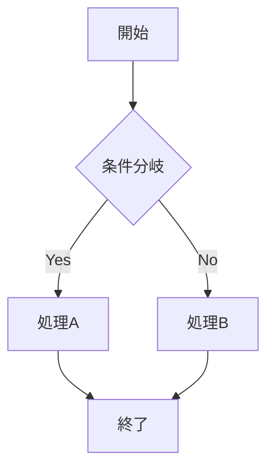
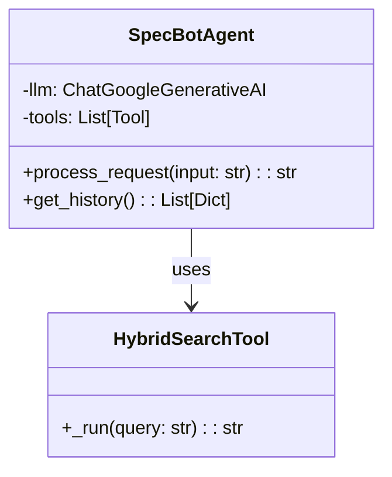
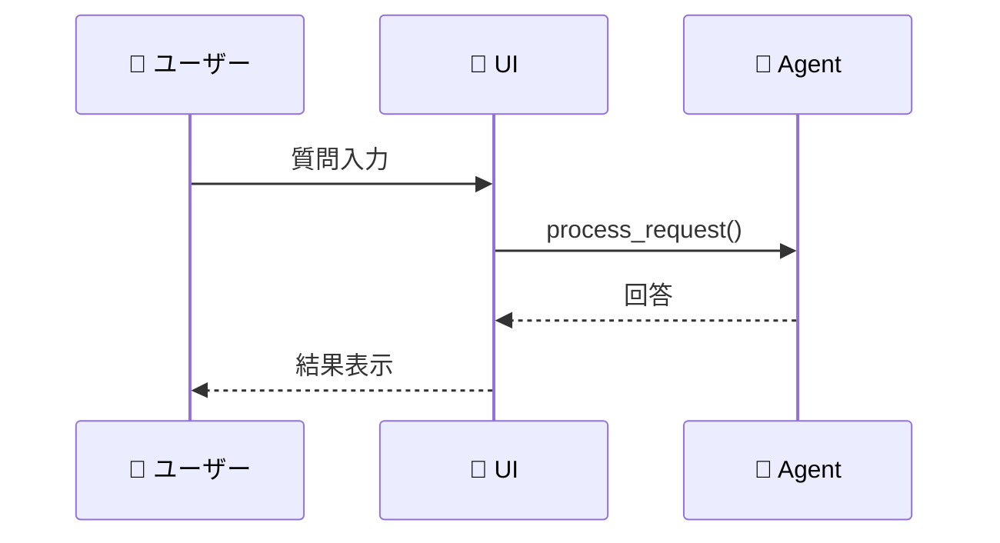
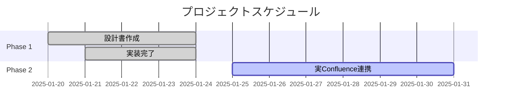
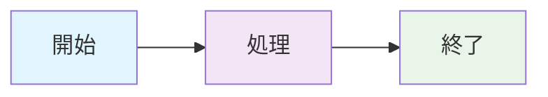
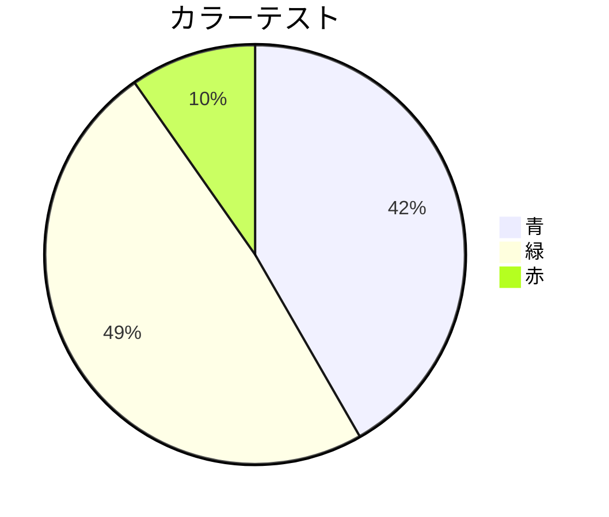

# Mermaid 図表示テスト

## 🧪 **VSCode Mermaid拡張機能テスト用サンプル**

### **1. シンプルなフローチャート**

### **2. クラス図サンプル**

### **3. シーケンス図サンプル**

### **4. ガントチャート**

## 📋 **表示確認チェックリスト**

- [ ] フローチャートが正しく表示される
- [ ] クラス図の関係線が描画される
- [ ] シーケンス図の参加者が表示される
- [ ] ガントチャートの期間が正しい
- [ ] 日本語テキストが正しく表示される
- [ ] 絵文字が正しく表示される

## 🎨 **スタイルテスト**

### **テーマ: Default**

### **カラーパレット確認**

---

**表示テスト手順:**
1. VSCodeでこのファイルを開く
2. `Ctrl+Shift+V` でプレビューを開く
3. 全ての図が正しく表示されることを確認
4. リアルタイム編集テスト（図を修正して即座に反映確認） 