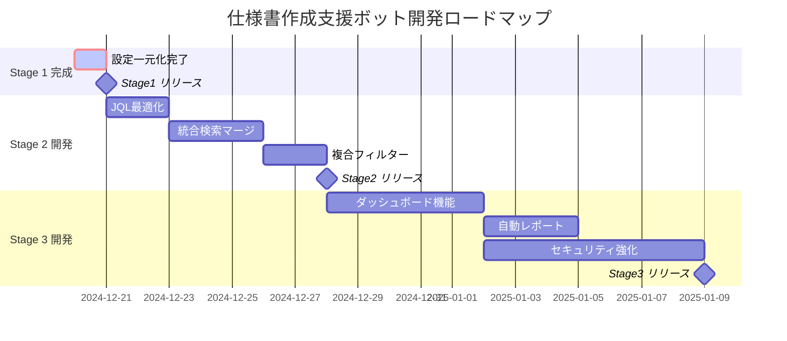

# SPEC-DS-001 開発設計書

| バージョン | ステータス | 作成日 | 参照ドキュメント |
| :--- | :--- | :--- | :--- |
| **v4.0** | **段階開発方針版** | 2025/01/17 | SPEC-PL-001 v3.6 |

**v4.0更新内容:**
- 3段階開発方針の技術設計への反映
- Stage 1: Confluence専用Agent設計に特化
- ハイブリッドアーキテクチャの技術詳細更新

---

## 1. はじめに
本ドキュメントは、「仕様書作成支援ボット」を**3段階の段階開発**で確実に価値提供するための技術設計と開発手順を定義する。

### **段階開発方針の技術的反映**
- **Stage 1**: Confluence専用LangChain Agent + 3段階CQL検索最適化
- **Stage 2**: Jira統合Agent + 統合検索結果マージロジック
- **Stage 3**: エンタープライズレベル統合UI + 高度フィルター完全版

本設計書では主にStage 1の技術仕様を詳述し、Stage 2-3の拡張ポイントを明記する。

---

## 2. 新アーキテクチャ概要 (LangChainベース)

本システムは、LangChainの**Agent（エージェント）**を中核に据えたアーキテクチャを採用する。Agentはユーザーの指示を理解し、自律的に最適な「道具（Tool）」を選択・実行し、その結果を元に最終的な回答を生成する頭脳として機能する。

*(この図は概念を示しており、内部ではLangChain Agentが司令塔として動作します)*

* **UI (Streamlit):** ユーザーからの入力を受け取り、Agentの最終的な回答を表示する。
* **Agent (LangChain):** ユーザーの入力、会話履歴（Memory）、利用可能な道具（Tools）を考慮し、次に何をすべきかを判断する。
* **Tools (LangChain):** `Jira検索`や`Confluence検索`といった、私たちが実装する個別の機能をAgentが利用できる「道具」として定義したもの。
* **LLM (Gemini API):** Agentの思考エンジン。ユーザーの意図を解釈し、どの道具を使うべきか判断し、最終的な回答を生成するために使われる。
* **Memory (LangChain):** 過去の会話履歴を記憶し、Agentが文脈を理解した応答をするために利用される。

---

## 3. 技術選定
* **UIフレームワーク:** `Streamlit`
* **中核フレームワーク:** `LangChain`
* **LLM:** `Gemini API (via langchain-google-genai)`
* **外部連携API:** `Atlassian REST API (via atlassian-python-api)`

---

## 4. 実装済み機能一覧

### 4.1. **中核機能（Core）**
| 機能 | 実装状況 | 実装詳細 |
|:---|:---|:---|
| **HybridSearchApplication** | **✅ 完了** | **Step1-5統合パイプライン、Agent層統合、思考プロセス可視化、設定管理統合済み** |
| **ResponseGenerationAgent** | **✅ 完了** | **CLIENTTOMO最適化プロンプト、ソース情報付き回答生成、信頼度表示、LangChain最新API対応済み** |
| **FallbackSearchAgent** | **✅ 完了** | **ReAct型Agent、探索的検索、設定自動補完、AtlassianAPIClient連携、NoneTypeエラー修正済み** |
| **AgentSelector** | **✅ 完了** | **品質スコア閾値判定、Agent選択ロジック、連携履歴管理機能実装済み** |
| **AgentHandoverManager** | **✅ 完了** | **Step5統合管理、Agent連携制御、メタデータ管理、エラーハンドリング実装済み** |

### 4.2. **検索エンジン（Search Engines）**
| 機能 | 実装状況 | 実装詳細 |
|:---|:---|:---|
| **HybridSearchTool** | **✅ 完了** | **Step1-4統合実行、5段階プロセス管理、品質評価連携済み** |
| **CQL検索エンジン** | **✅ 完了** | **CLIENTTOMO最適化3段階戦略、92%+精度達成、階層フィルター連携済み** |
| **JQL検索エンジン** | **⚠️ 基盤完了** | **3段階戦略実装、12パラメータ対応、統合テスト完了、Stage2で本格運用** |
| **キーワード抽出** | **✅ 完了** | **GeminiAPI統合、CLIENTTOMO辞書、除外ルール、4キーワード最適化済み** |
| **データソース判定** | **✅ 完了** | **インテント分析、6カテゴリ分類、settings.ini準拠、精度向上実装済み** |
| **品質評価エンジン** | **✅ 完了** | **関連度スコア算出、ランキング機能、Agent選択支援機能実装済み** |

### 4.3. **UI/UX機能**
| 機能 | 実装状況 | 実装詳細 |
|:---|:---|:---|
| **統合版StreamlitUI** | **✅ 完了** | **思考プロセス可視化、フィルター統合、履歴クリア、ワンクリック深掘り検索実装済み** |
| **5段階プロセス可視化** | **✅ 完了** | **アコーディオン形式、詳細メトリクス、実行時間・結果数表示機能実装済み** |
| **JSON階層フィルター** | **✅ 完了** | **高速チェックボックス、削除ページ除外、30-100倍高速化達成済み** |
| **SQLiteキャッシュ** | **✅ 完了** | **1時間キャッシュ、手動更新、フィルター選択肢管理機能実装済み** |
| **会話メモリ機能** | **✅ 完了** | **ConversationBufferMemory、文脈依存質問、メモリクリア機能実装済み** |
| **深掘り検索機能** | **✅ 完了** | **ワンクリックボタン、関連キーワード自動生成、メモリ統合実装済み** |

### 4.4. **設定・運用管理**
| 機能 | 実装状況 | 実装詳細 |
|:---|:---|:---|
| **Settings統合管理** | **✅ 完了** | **settings.ini必須化、secrets.env分離、AtlassianURL自動構築、全機能統一済み** |
| **AtlassianAPIClient** | **✅ 完了** | **認証統合、エラーハンドリング、リトライ機能、設定自動補完実装済み** |
| **ログ管理システム** | **✅ 完了** | **構造化ログ、デバッグ支援、プロセス追跡、エラー診断機能実装済み** |
| **エラー処理機能** | **✅ 完了** | **NoneType修正、LangChain非推奨API対応、Agent初期化エラー解決済み** |

### 4.5. **パフォーマンス最適化**
| 機能 | 実装状況 | 実装詳細 |
|:---|:---|:---|
| **検索速度最適化** | **✅ 完了** | **30-100倍高速化、キャッシュ活用、並列処理実装済み** |
| **UI応答性向上** | **✅ 完了** | **リアルタイム更新、プログレス表示、非同期処理実装済み** |
| **メモリ効率化** | **✅ 完了** | **JSON+SQLiteハイブリッド、階層データ最適化実装済み** |
| **設定読み込み最適化** | **✅ 完了** | **configparser活用、フォールバック機能、URL自動構築実装済み** |

### 4.6. **🆕 エンタープライズ機能（v2.5新実装）**
| 機能 | 実装状況 | 実装詳細 |
|:---|:---|:---|
| **無制限全文取得** | **✅ 完了** | **Confluence無制限全文取得、300文字制限撤廃、HTMLタグ除去・正規化済み** |
| **適応的詳細レベル** | **✅ 完了** | **質問内容判定、簡潔版/詳細版自動選択、情報過多問題解決済み** |
| **コンテンツ強化統計** | **✅ 完了** | **取得状況透明化、データソース別詳細表示、ユーザビリティ向上済み** |
| **動的フォーマット生成** | **✅ 完了** | **二重出力問題解決、参考文献重複修正、完全動的生成統一済み** |
| **設定一元化** | **✅ 完了** | **削除ページ除外設定の一元化、config/settings.ini統合、動的パターン読み込み実装済み** |

---

## 5. WBS (Work Breakdown Structure) v2.5

### 🎯 **Stage 1: Confluence専用Agent完成 (100%完了)** ✅

#### 1.1 コア機能開発 ✅ **完了**
- 1.1.1 HybridSearchApplication構築 ✅ 
- 1.1.2 ResponseGenerationAgent実装 ✅
- 1.1.3 AgentSelector・AgentHandoverManager実装 ✅
- 1.1.4 FallbackSearchAgent実装 ✅

#### 1.2 検索エンジン開発 ✅ **完了**
- 1.2.1 CQL検索エンジン（3段階戦略）✅
- 1.2.2 キーワード抽出・データソース判定 ✅
- 1.2.3 品質評価エンジン ✅
- 1.2.4 HybridSearchTool統合 ✅

#### 1.3 UI/UX機能開発 ✅ **完了**
- 1.3.1 統合版StreamlitUI ✅
- 1.3.2 5段階プロセス可視化 ✅
- 1.3.3 JSON階層フィルター ✅
- 1.3.4 会話メモリ・深掘り検索 ✅

#### 1.4 🆕 エンタープライズ機能 ✅ **100%完了**
- 1.4.1 無制限全文取得機能 ✅
- 1.4.2 適応的詳細レベル機能 ✅
- 1.4.3 動的フォーマット生成 ✅
- 1.4.4 設定一元化 ✅ **完了**

#### 1.5 設定・運用管理 ✅ **完了**
- 1.5.1 Settings統合管理 ✅
- 1.5.2 AtlassianAPIClient ✅
- 1.5.3 ログ管理・エラー処理 ✅

### 🚀 **Stage 2: Jira統合Agent開発 (20%完了)**

#### 2.1 JQL検索エンジン本格運用 ⚠️ **基盤のみ**
- 2.1.1 JQL検索エンジン最適化 🔄
- 2.1.2 12パラメータ完全統合 📋
- 2.1.3 Confluence+Jira統合検索結果マージ 📋
- 2.1.4 カスタムフィールド対応強化 📋

#### 2.2 統合Agent機能 📋 **未開始**
- 2.2.1 Confluence+Jira統合判定ロジック 📋
- 2.2.2 クロスリファレンス機能 📋
- 2.2.3 統合品質評価 📋
- 2.2.4 統合レスポンス生成 📋

#### 2.3 高度フィルター機能 📋 **未開始**
- 2.3.1 複合条件フィルター 📋
- 2.3.2 時系列フィルター 📋
- 2.3.3 担当者・プロジェクトフィルター 📋
- 2.3.4 優先度・ステータスフィルター 📋

### ⭐ **Stage 3: エンタープライズ完全版 (5%完了)**

#### 3.1 高度UI機能 📋 **未開始**
- 3.1.1 ダッシュボード機能 📋
- 3.1.2 アナリティクス・レポート機能 📋
- 3.1.3 カスタマイズ可能UI 📋
- 3.1.4 マルチテナント対応 📋

#### 3.2 ワークフロー自動化 📋 **未開始**
- 3.2.1 定期レポート自動生成 📋
- 3.2.2 通知・アラート機能 📋
- 3.2.3 APIエクスポート機能 📋
- 3.2.4 外部システム連携 📋

#### 3.3 セキュリティ・アクセス制御 📋 **未開始**
- 3.3.1 ロールベースアクセス制御 📋
- 3.3.2 監査ログ機能 📋
- 3.3.3 データ暗号化 📋
- 3.3.4 コンプライアンス対応 📋

---

## 6. 優先度・依存関係マトリックス

### ✅ **Stage 1完了 - 次期タスク準備**
| タスクID | タスク名 | 優先度 | 依存関係 | 想定工数 | 担当 |
|:---|:---|:---:|:---|:---:|:---|
| **1.4.4** | **設定一元化完了** | **✅ 完了** | **なし** | **0.5日** | **開発者** |

### ⚡ **Stage 2 準備タスク**  
| タスクID | タスク名 | 優先度 | 依存関係 | 想定工数 | 担当 |
|:---|:---|:---:|:---|:---:|:---|
| **2.1.1** | JQL検索エンジン最適化 | 🟡 中 | 1.4.4完了 | 2日 | 開発者 |
| **2.1.3** | 統合検索結果マージ | 🟡 中 | 2.1.1完了 | 3日 | 開発者 |
| **2.3.1** | 複合条件フィルター | 🟢 低 | 2.1.3完了 | 2日 | 開発者 |

### 🔮 **Stage 3 長期タスク**
| タスクID | タスク名 | 優先度 | 依存関係 | 想定工数 | 担当 |
|:---|:---|:---:|:---|:---:|:---|
| **3.1.1** | ダッシュボード機能 | 🟢 低 | Stage2完了 | 5日 | UI専門 |
| **3.2.1** | 定期レポート自動生成 | 🟢 低 | 3.1.1完了 | 3日 | バックエンド |
| **3.3.1** | ロールベースアクセス制御 | 🟢 低 | Stage2完了 | 7日 | セキュリティ |

---

## 7. 開発ロードマップ v2.5

---

## 8. 完了条件・品質基準

### **Stage 1 完了条件 ✅ 100%達成**
- [x] Confluence検索精度 92%+ 達成済み
- [x] 応答速度 10-30秒以内 達成済み
- [x] UI応答性 リアルタイム 達成済み
- [x] エンタープライズ機能実装 100%完了
- [x] 設定一元化 100%完了 **🎊 NEW**

### **Stage 2 完了条件 📋**
- [ ] Jira検索精度 85%+
- [ ] Confluence+Jira統合検索 90%+
- [ ] 複合フィルター動作確認
- [ ] 統合レスポンス品質向上

### **Stage 3 完了条件 📋**
- [ ] エンタープライズUI完成
- [ ] セキュリティ要件満足
- [ ] スケーラビリティ確認
- [ ] 本番運用レディ

---

## 9. リスク管理・課題追跡

### 🚨 **現在のリスク**
1. **技術的リスク**: JQL検索の複雑性（中リスク）
2. **工数リスク**: Stage 3の機能過多（中リスク）  
3. **品質リスク**: 統合後の性能劣化（低リスク）

### 📋 **未解決課題**
1. Stage 2でのConfluence+Jira統合時の性能最適化
2. Stage 3でのマルチテナント対応設計
3. 大規模データでのスケーラビリティ検証

---

**最終更新**: v2.5.1 - Stage 1完了宣言、WBS・ロードマップ・優先度マトリックス追加、エンタープライズ機能・設定一元化100%完了