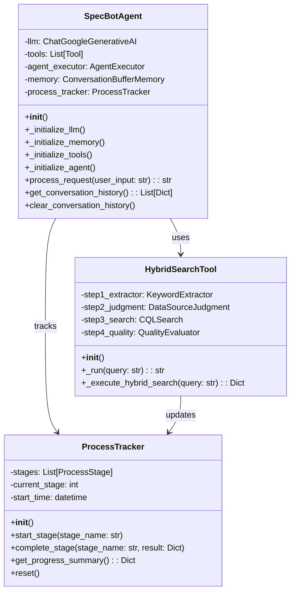
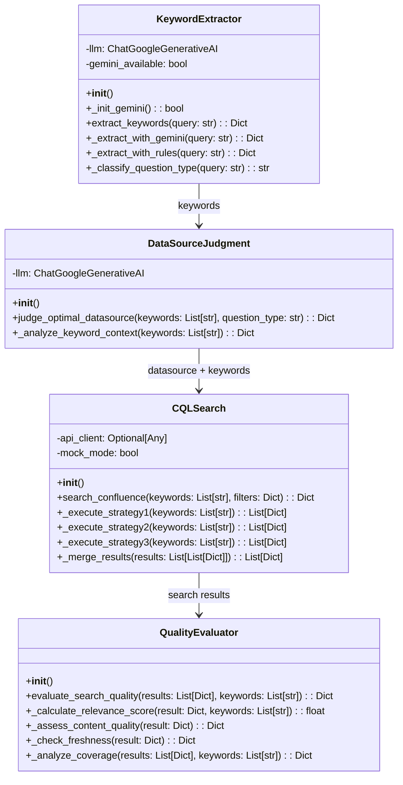
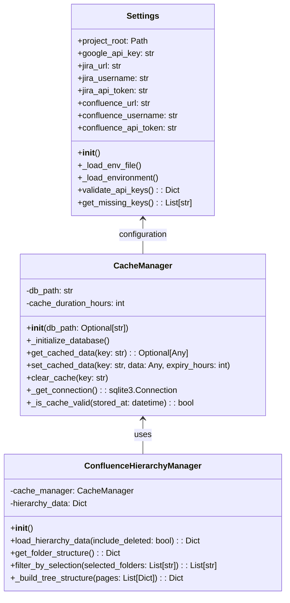
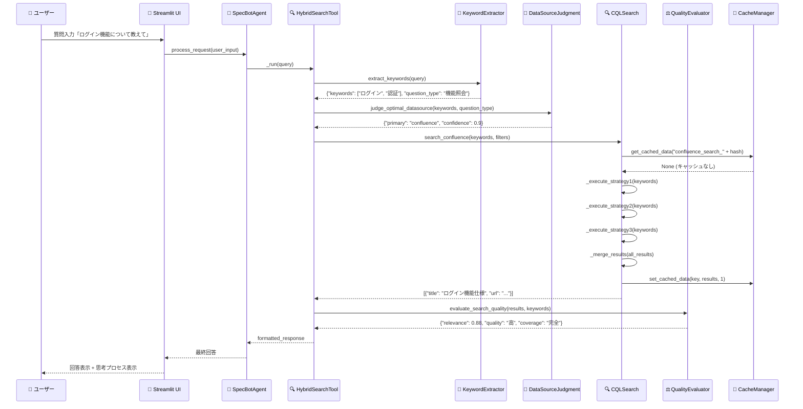
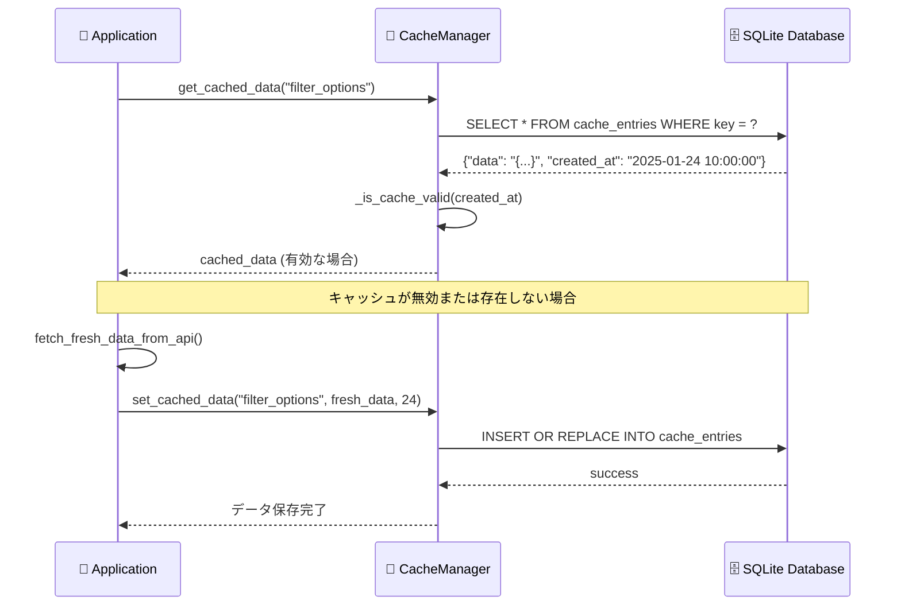
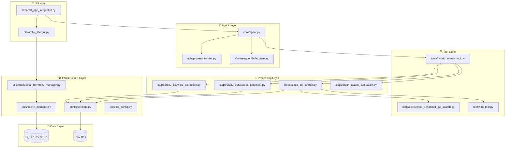
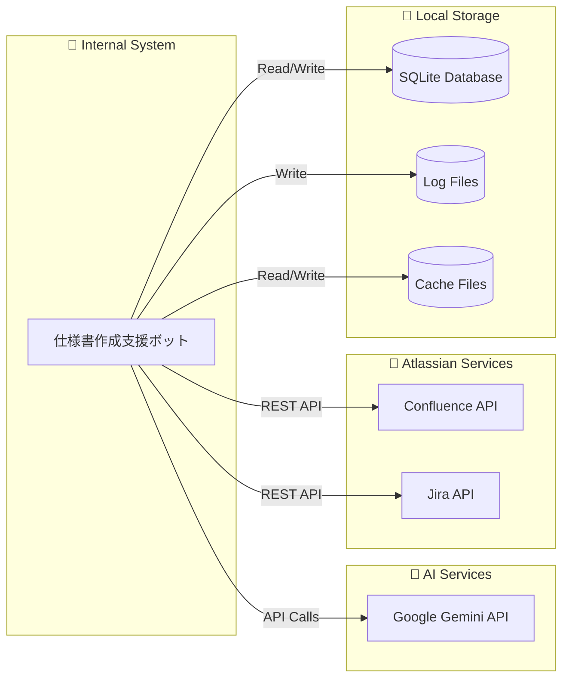
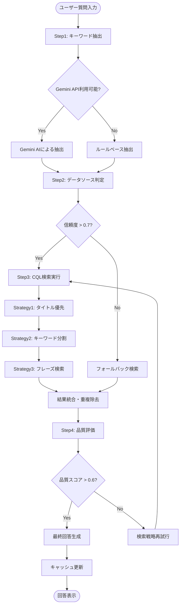

# SPEC-DS-005 UML設計書

| バージョン | ステータス | 作成日 | 参照ドキュメント |
| :--- | :--- | :--- | :--- |
| **v1.0** | **最新版** | 2025/01/24 | SPEC-DS-001 開発設計書, SPEC-DS-002 ハイブリッド検索システム仕様書 |

---

## 📐 **概要**
本ドキュメントは、「仕様書作成支援ボット」のシステムアーキテクチャをUML（統一モデリング言語）で視覚化し、クラス構造・処理フロー・コンポーネント関係を明確に定義するものである。

---

## 🏗️ **1. システム全体アーキテクチャ**

### **1.1 レイヤー構成**
```
┌─────────────────────────────────────────────────────────────┐
│                    🎨 プレゼンテーション層                    │
│  Streamlit UI (streamlit_app_integrated.py)                │
├─────────────────────────────────────────────────────────────┤
│                    🧠 アプリケーション層                      │
│  SpecBotAgent (LangChain) + HybridSearchTool              │
├─────────────────────────────────────────────────────────────┤
│                    🔍 ビジネスロジック層                      │
│  Step1-4 Processing + CQL/JQL Search Engines             │
├─────────────────────────────────────────────────────────────┤
│                    🛠️ インフラストラクチャ層                  │
│  Cache Manager (SQLite) + API Clients                    │
└─────────────────────────────────────────────────────────────┘
```

---

## 📊 **2. クラス図**

### **2.1 エージェント・ツール層**


### **2.2 検索処理層 (Step1-4)**


### **2.3 インフラストラクチャ層**


---

## 🔄 **3. シーケンス図**

### **3.1 ユーザー質問処理フロー**


### **3.2 キャッシュ管理フロー**


---

## 🧩 **4. コンポーネント図**

### **4.1 モジュール構成**


### **4.2 外部システム依存関係**


---

## 🔄 **5. アクティビティ図**

### **5.1 ハイブリッド検索プロセス**


---

## 📋 **6. 設計パターン・原則**

### **6.1 適用設計パターン**
- **Strategy Pattern**: Step3のCQL検索戦略切り替え
- **Factory Pattern**: Tool作成時の動的生成
- **Observer Pattern**: ProcessTrackerによる進捗監視
- **Singleton Pattern**: Settings、CacheManagerの単一インスタンス
- **Adapter Pattern**: LangChain ToolとStep1-4の連携

### **6.2 SOLID原則適用**
- **Single Responsibility**: 各Stepクラスは単一責務
- **Open/Closed**: 新検索戦略の追加が容易
- **Liskov Substitution**: Tool継承構造の置換可能性
- **Interface Segregation**: 最小限のインターフェース定義
- **Dependency Inversion**: 依存性注入による疎結合

---

## 🔧 **7. 技術的考慮事項**

### **7.1 パフォーマンス設計**
- **非同期処理**: 複数検索戦略の並列実行可能性
- **キャッシュ戦略**: SQLiteによる1時間キャッシュ
- **メモリー管理**: LangChainメモリーの適切な制限

### **7.2 拡張性設計**
- **プラグイン機構**: 新ツール追加の容易性
- **設定外部化**: 環境変数による柔軟な設定
- **モジュール分離**: レイヤー間の疎結合

### **7.3 保守性設計**
- **ログ統合**: 構造化ログによる問題追跡
- **エラーハンドリング**: 段階的フォールバック
- **テスト容易性**: 依存性注入による単体テスト支援

---

*最終更新: 2025年1月24日 - v1.0 システム完成版* 