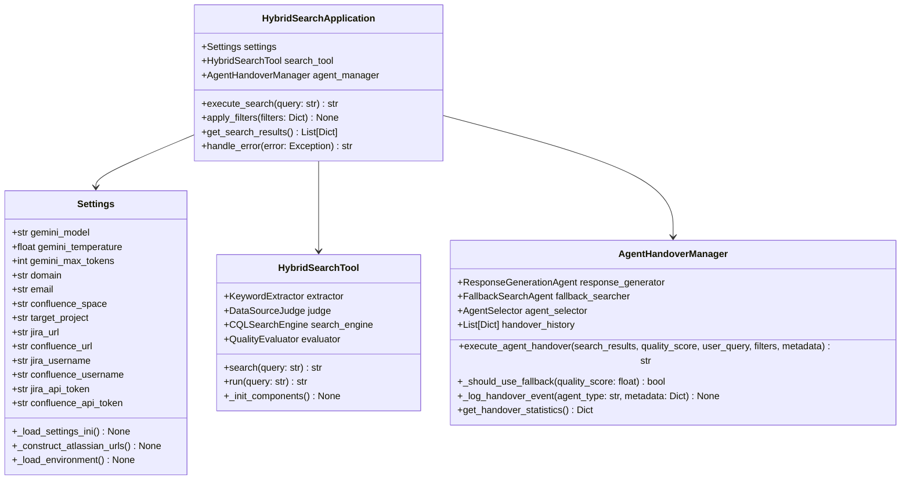
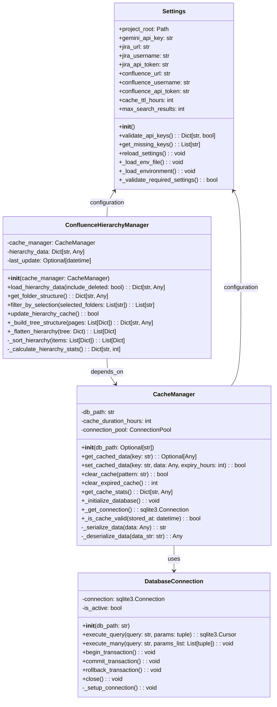
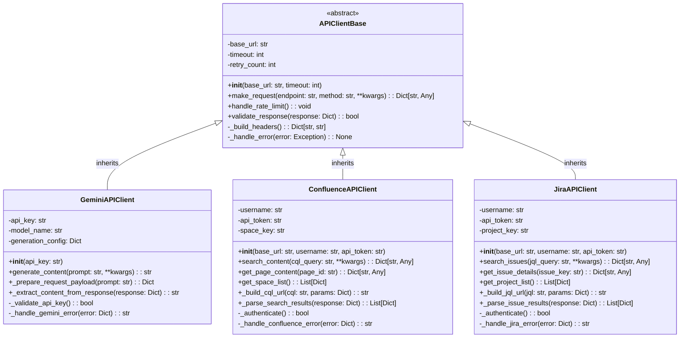
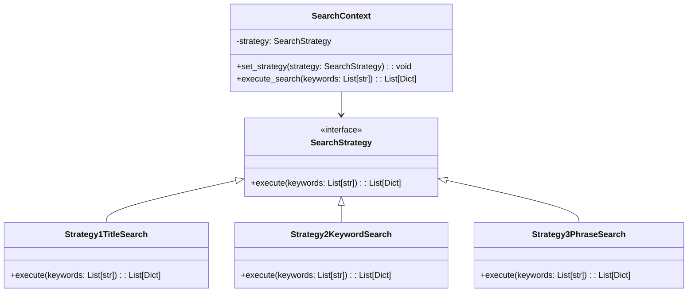
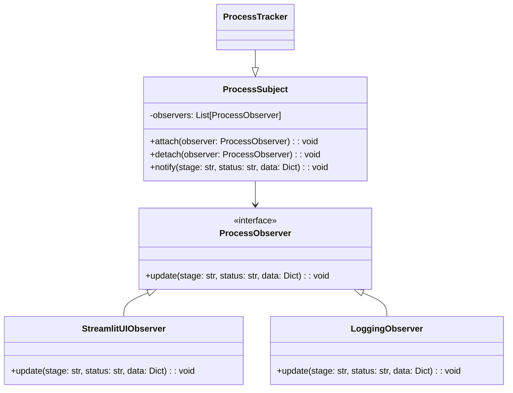
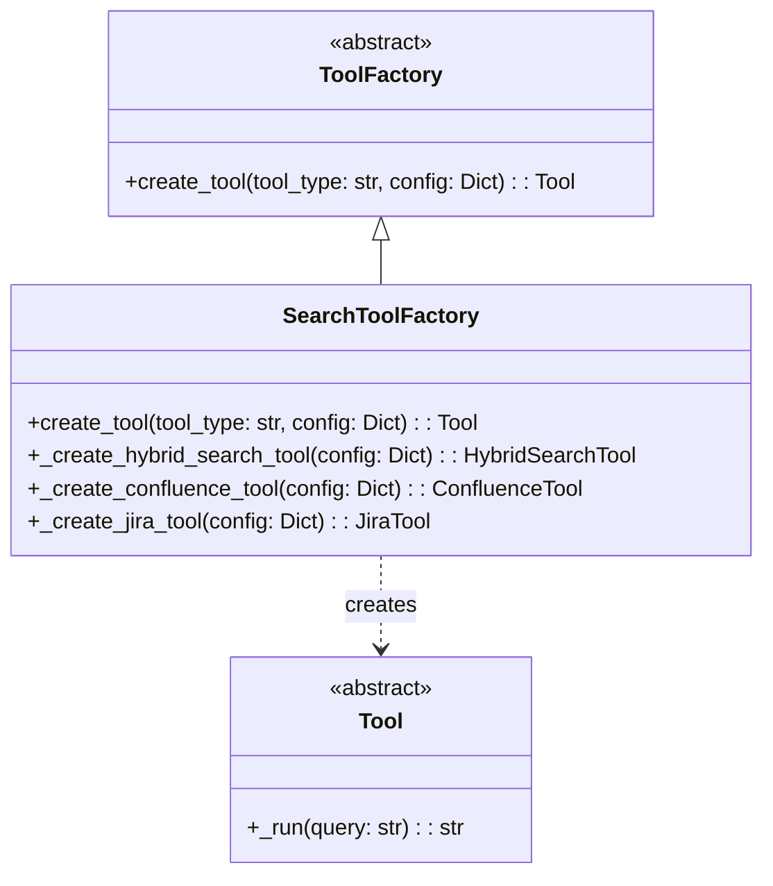

# SPEC-DS-005A クラス図設計書

| バージョン | ステータス | 作成日 | 参照ドキュメント |
| :--- | :--- | :--- | :--- |
| **v1.0** | **最新版** | 2025/01/24 | SPEC-DS-001 開発設計書, SPEC-DS-002 ハイブリッド検索システム仕様書 |

---

## 📊 **概要**
本ドキュメントは、「仕様書作成支援ボット」のクラス構造・継承関係・依存関係をUMLクラス図で詳細に定義するものである。システムの静的構造を明確化し、オブジェクト指向設計の理解を促進する。

---

## 🏗️ **1. システムクラス概観**

### **1.1 パッケージ構成**
```
📦 仕様書作成支援ボット
├── 🎨 presentation (プレゼンテーション層)
│   ├── streamlit_app_integrated.py
│   └── hierarchy_filter_ui.py
├── 🧠 application (アプリケーション層)
│   ├── SpecBotAgent
│   └── ProcessTracker
├── 🔍 domain (ドメイン層)
│   ├── HybridSearchTool
│   ├── KeywordExtractor
│   ├── DataSourceJudgment
│   ├── CQLSearch
│   └── QualityEvaluator
└── 🛠️ infrastructure (インフラ層)
    ├── CacheManager
    ├── Settings
    └── ConfluenceHierarchyManager
```

---

## 📊 **2. 詳細クラス図**

### **2.1 アプリケーション層クラス図**


### **2.2 ドメイン層 - ツール・検索クラス図**

```mermaid
classDiagram
    class KeywordExtractor {
        +Settings settings
        +ChatGoogleGenerativeAI llm
        +Dict clienttomo_dictionary
        +extract_keywords(query: str) Dict[str, Any]
        +_extract_with_gemini(query: str) Dict
        +_extract_with_rules(query: str) Dict
        +_init_clienttomo_dictionary() None
        +_validate_keywords(keywords: List[str]) List[str]
    }
    
    class DataSourceJudge {
        +Settings settings  
        +ChatGoogleGenerativeAI llm
        +judge_datasource(keyword_result: Dict) Dict[str, Any]
        +_analyze_intent(query: str, keywords: List[str]) Dict
        +_determine_optimal_source(intent: Dict, keywords: List[str]) str
        +_calculate_confidence(analysis: Dict) float
    }
    
    class CQLSearchEngine {
        +AtlassianAPIClient api_client
        +execute_search(datasource_result: Dict, keyword_result: Dict) List[Dict]
        +_execute_confluence_search(keywords: List[str], filters: Dict) List[Dict]
        +_execute_jira_search(keywords: List[str], filters: Dict) List[Dict]
        +_build_cql_query(keywords: List[str], filters: Dict) str
        +_build_jql_query(keywords: List[str], filters: Dict) str
        +_apply_three_stage_strategy(base_query: str) List[str]
    }
    
    class QualityEvaluator {
        +evaluate_and_rank(search_results: List[Dict], keywords: Dict, datasource: Dict) Dict[str, Any]
        +_calculate_relevance_score(result: Dict, keywords: List[str]) float
        +_rank_results(results: List[Dict]) List[Dict]
        +_generate_quality_metadata(results: List[Dict]) Dict
        +_determine_agent_recommendation(quality_score: float) str
    }

    HybridSearchTool --> KeywordExtractor
    HybridSearchTool --> DataSourceJudge
    HybridSearchTool --> CQLSearchEngine
    HybridSearchTool --> QualityEvaluator
```


### **2.3 インフラストラクチャ層クラス図**


### **2.4 外部API連携クラス図**


---

## 🔗 **3. クラス関係・依存関係詳細**

### **3.1 継承関係 (IS-A)**
- `GeminiAPIClient` IS-A `APIClientBase`
- `ConfluenceAPIClient` IS-A `APIClientBase`
- `JiraAPIClient` IS-A `APIClientBase`

### **3.2 集約関係 (HAS-A)**
- `SpecBotAgent` HAS-A `ProcessTracker`
- `HybridSearchTool` HAS-A `KeywordExtractor`, `DataSourceJudgment`, `CQLSearch`, `QualityEvaluator`
- `CacheManager` HAS-A `DatabaseConnection`

### **3.3 依存関係 (USES)**
- `ConfluenceHierarchyManager` USES `CacheManager`
- `KeywordExtractor` USES `GeminiAPIClient`
- `CQLSearch` USES `ConfluenceAPIClient`

### **3.4 関連関係 (ASSOCIATES)**
- `ProcessTracker` ↔ `ProcessStage` (1:many)
- `CacheManager` ↔ `Settings` (many:1)

---

## 📋 **4. 設計パターン適用**

### **4.1 Strategy Pattern**


### **4.2 Observer Pattern**


### **4.3 Factory Pattern**


---

## 🔧 **5. クラス責務・原則**

### **5.1 Single Responsibility Principle (SRP)**
| クラス | 単一責務 |
|--------|----------|
| `KeywordExtractor` | キーワード抽出のみ |
| `DataSourceJudgment` | データソース判定のみ |
| `CQLSearch` | CQL検索実行のみ |
| `QualityEvaluator` | 品質評価のみ |
| `CacheManager` | キャッシュ管理のみ |

### **5.2 Open/Closed Principle (OCP)**
- **SearchStrategy**: 新検索戦略追加時、既存コード変更不要
- **APIClientBase**: 新API追加時、継承で対応可能
- **ProcessObserver**: 新通知先追加時、既存観察者への影響なし

### **5.3 Liskov Substitution Principle (LSP)**
- **APIClientBase派生クラス**: 基底クラスと置換可能
- **SearchStrategy実装**: インターフェース準拠で置換可能

### **5.4 Interface Segregation Principle (ISP)**
- **ProcessObserver**: 必要なメソッドのみ定義
- **SearchStrategy**: 検索実行に特化したインターフェース

### **5.5 Dependency Inversion Principle (DIP)**
- **高レベルモジュール**: 抽象に依存（APIClientBase使用）
- **低レベルモジュール**: 具象実装（GeminiAPIClient等）

---

## 🚀 **6. 拡張性・保守性考慮**

### **6.1 新機能追加時の拡張ポイント**
1. **新検索戦略**: `SearchStrategy`インターフェース実装
2. **新API連携**: `APIClientBase`継承
3. **新品質評価軸**: `QualityEvaluator`メソッド追加
4. **新キャッシュ戦略**: `CacheManager`拡張

### **6.2 テスト容易性**
- **依存性注入**: コンストラクタ注入によるモック可能
- **インターフェース分離**: 単体テスト時の部分モック
- **純粋関数**: 副作用なしの関数による予測可能性

---

*最終更新: 2025年1月24日 - v1.0 クラス構造完成版* 