# SPEC-DS-005B シーケンス図設計書

| バージョン | ステータス | 作成日 | 参照ドキュメント |
| :--- | :--- | :--- | :--- |
| **v1.0** | **最新版** | 2025/01/24 | SPEC-DS-005A クラス図設計書, SPEC-DS-007 API設計書 |

---

## 🔄 **概要**
本ドキュメントは、「仕様書作成支援ボット」の動的な処理フロー・時系列相互作用をUMLシーケンス図で詳細に定義するものである。オブジェクト間のメッセージ交換・処理順序・タイミングを明確化する。

---

## 2.1. メインシーケンス（実装版）

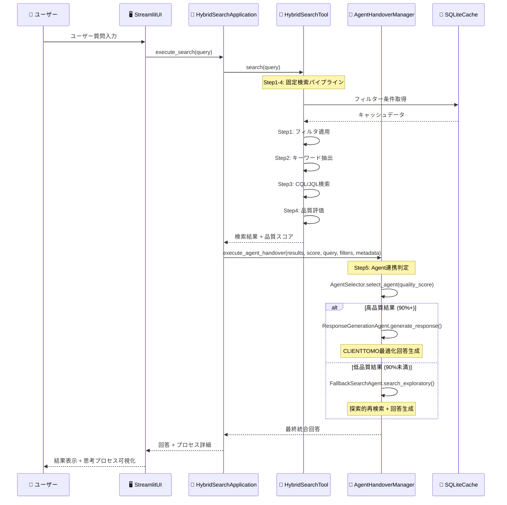

## 2.2. 詳細Agent連携シーケンス（実装版）

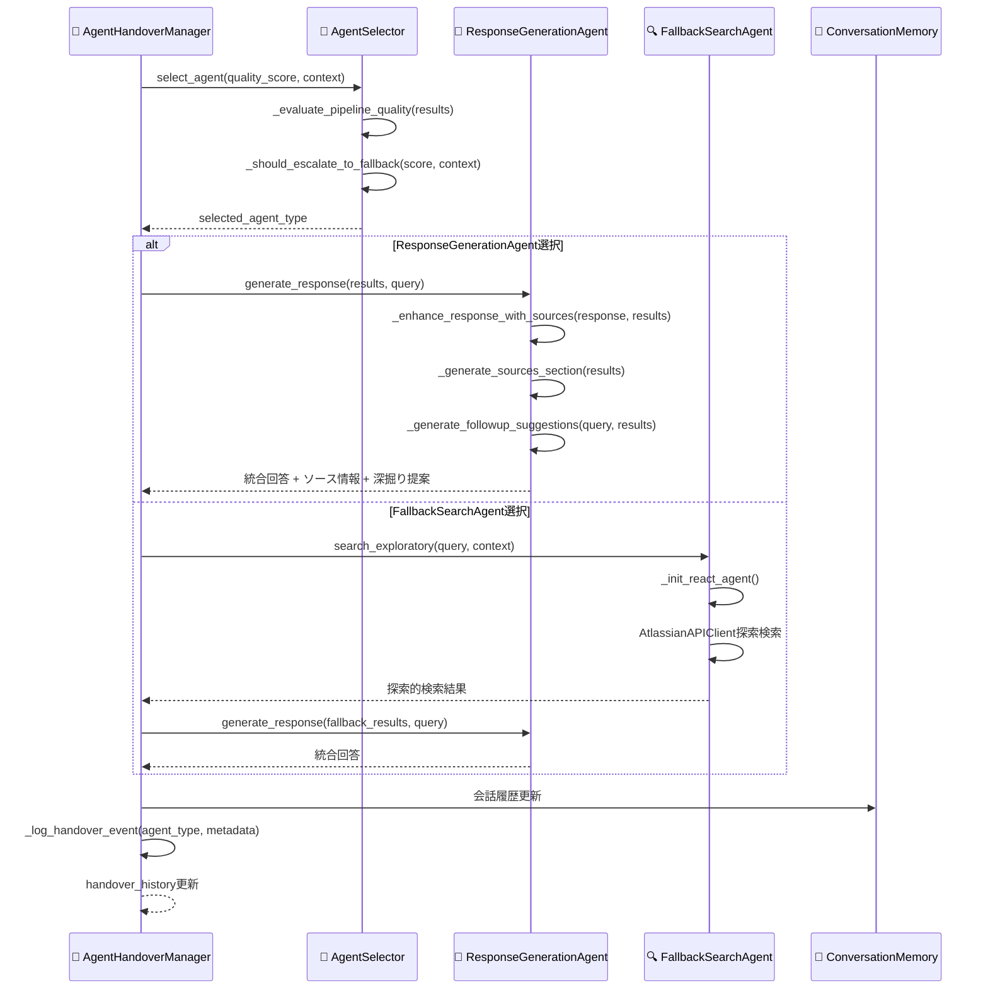

---

## 🔍 **2. ハイブリッド検索詳細シーケンス**

### **2.1 Step1-5処理フロー**
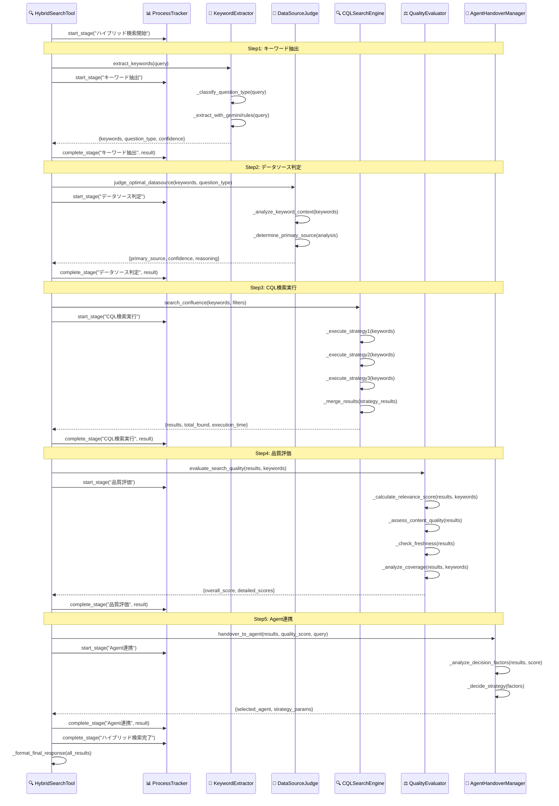

---

## 🤖 **3. Gemini API連携シーケンス**

### **3.1 キーワード抽出時のGemini呼び出し**
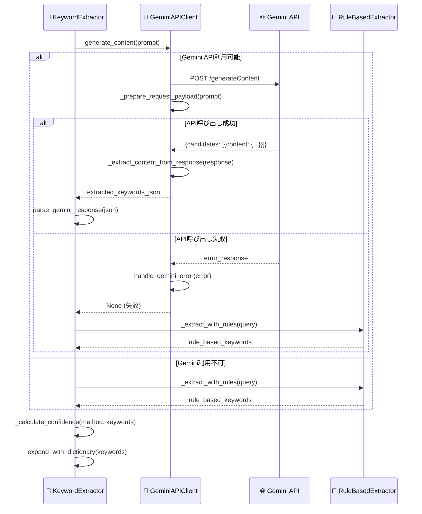

---

## 💾 **4. キャッシュ管理シーケンス**

### **4.1 キャッシュ取得・設定フロー**
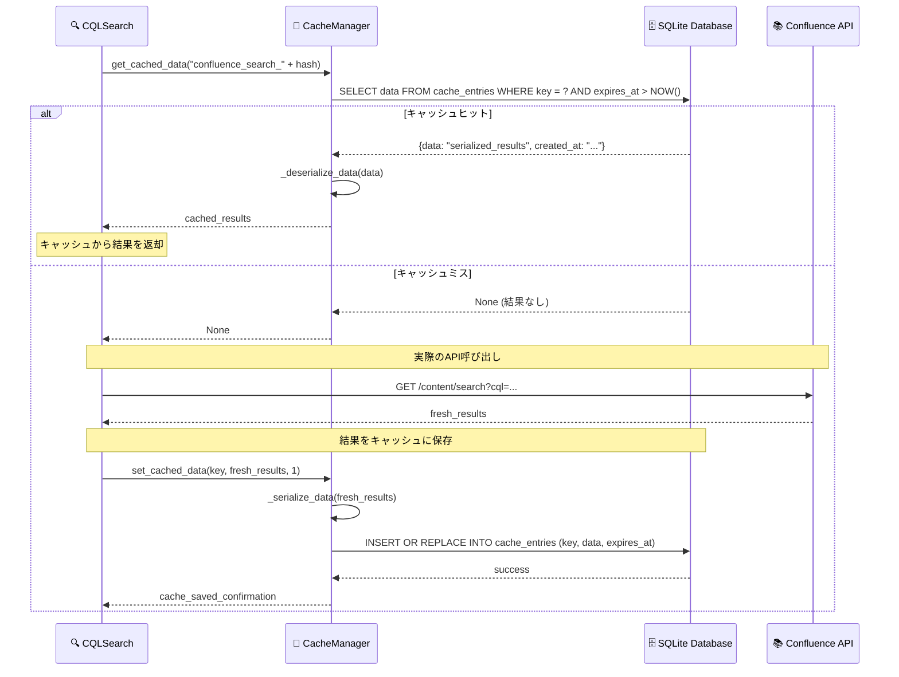

### **4.2 期限切れキャッシュクリーンアップ**
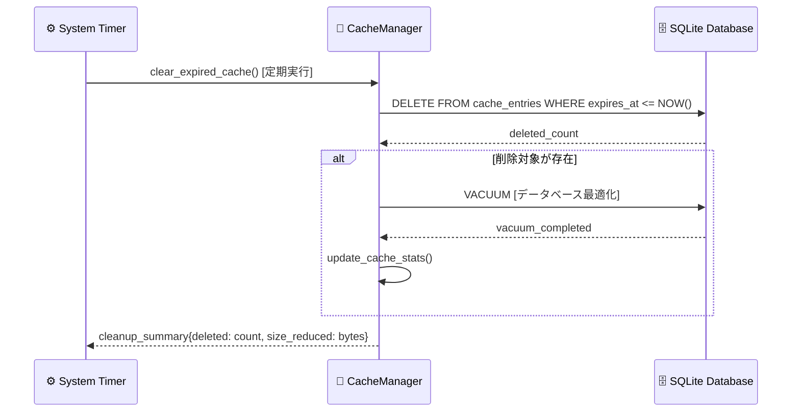

---

## 🔄 **5. エラーハンドリング・フォールバック**

### **5.1 外部API障害時のフォールバック**
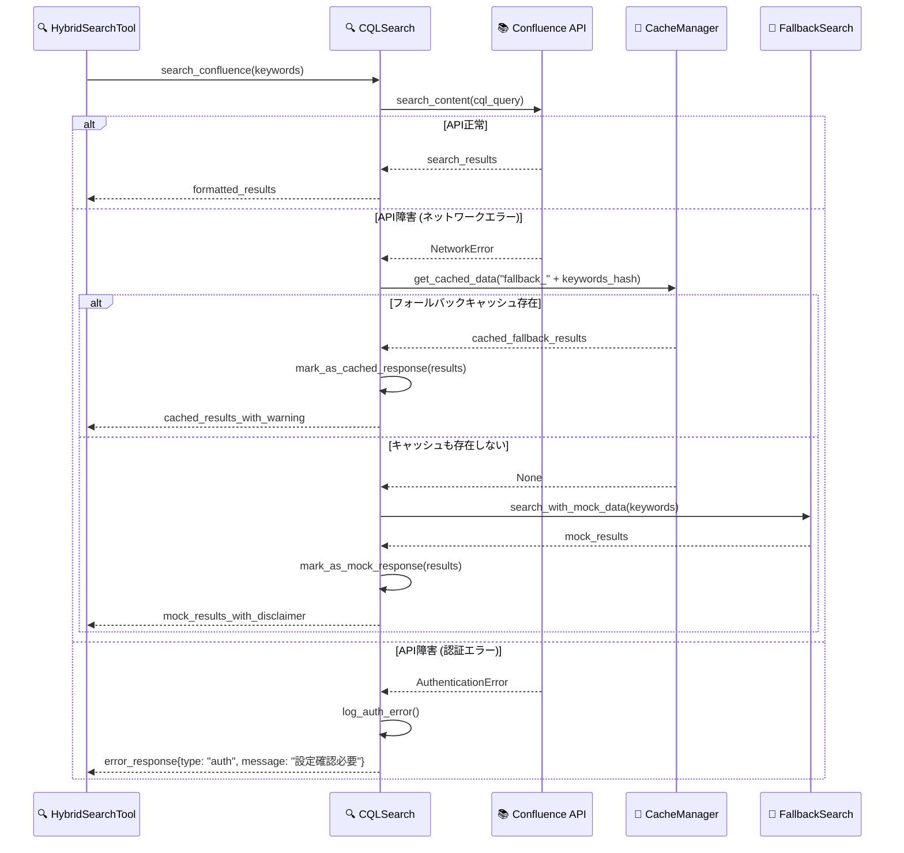

### **5.2 品質評価フォールバック**
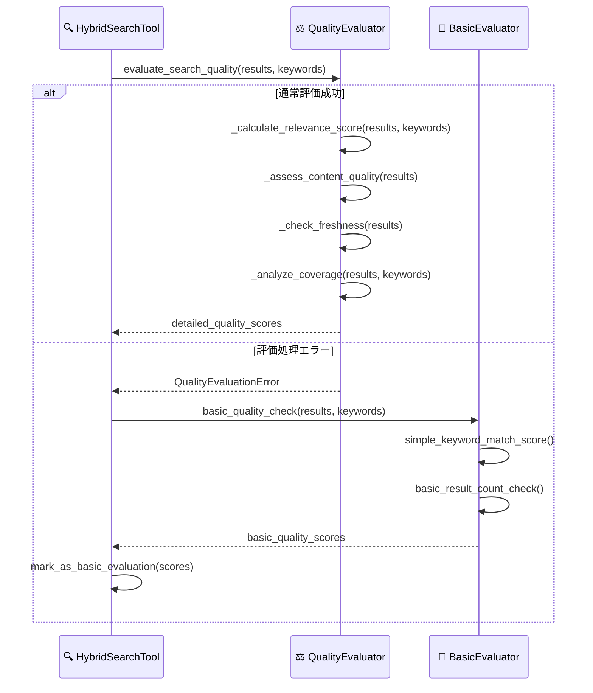

---

## 🎨 **6. UI更新・リアルタイム表示**

### **6.1 思考プロセス表示更新**
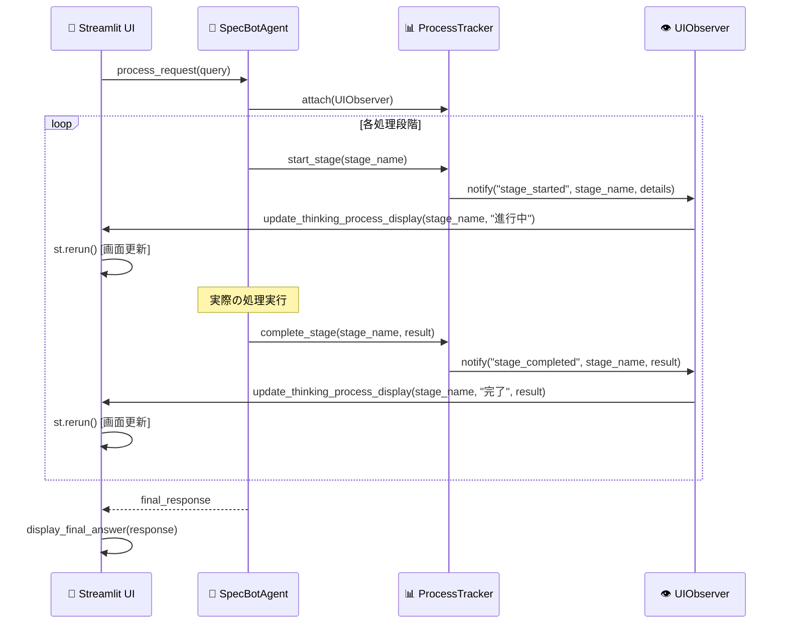

### **6.2 会話履歴管理・クリア機能**
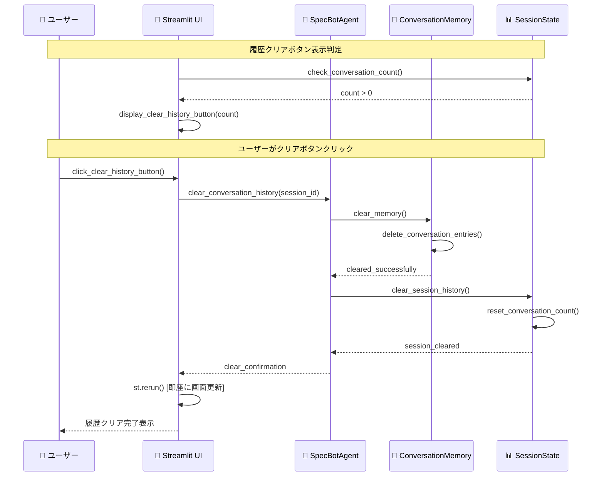

---

## 🚀 **7. 深掘り検索・メモリー連携**

### **7.1 ワンクリック深掘り検索**
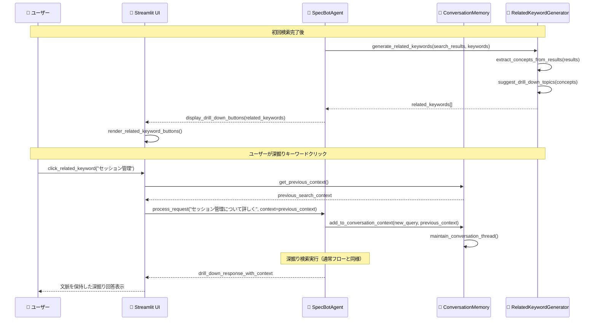

---

## ⚡ **8. 並列処理・非同期実行**

### **8.1 複数検索戦略の並列実行**
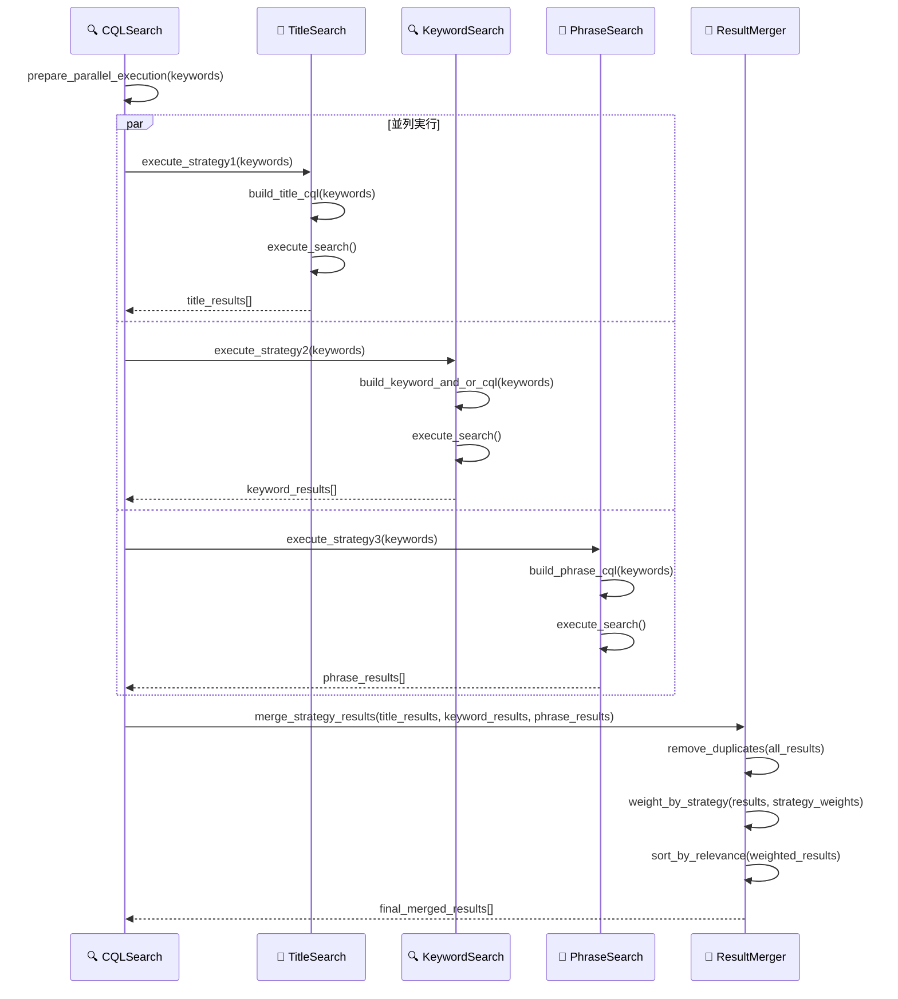

---

## 📊 **9. パフォーマンス監視・メトリクス**

### **9.1 処理時間測定・ログ記録**
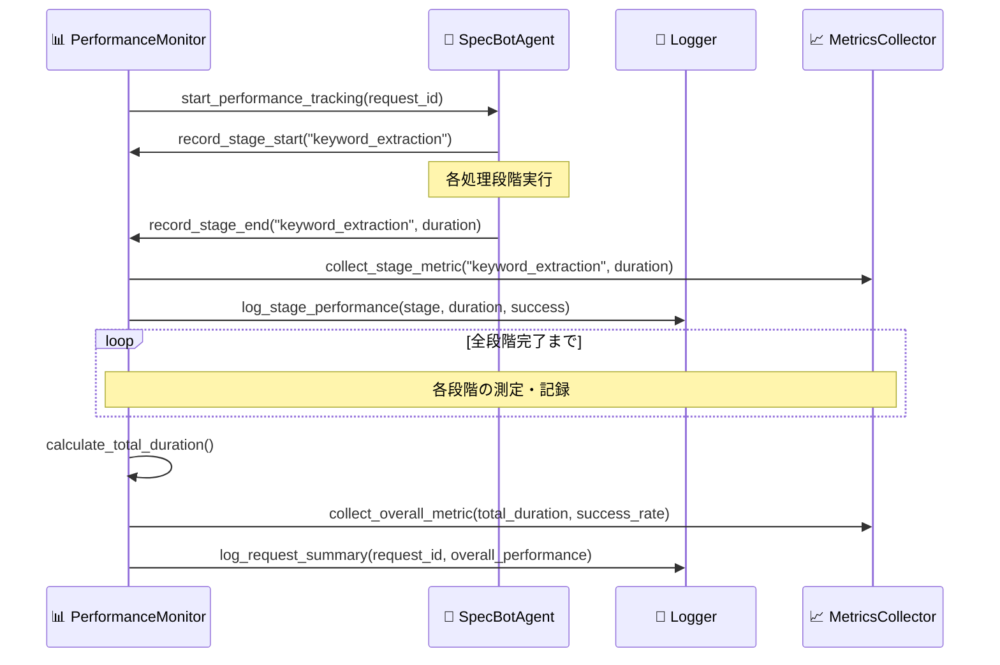

---

*最終更新: 2025年1月24日 - v1.0 処理フロー完成版* 