# SPEC-DS-005B シーケンス図設計書

| バージョン | ステータス | 作成日 | 参照ドキュメント |
| :--- | :--- | :--- | :--- |
| **v1.0** | **最新版** | 2025/01/24 | SPEC-DS-005A クラス図設計書, SPEC-DS-007 API設計書 |

---

## 🔄 **概要**
本ドキュメントは、「仕様書作成支援ボット」の動的な処理フロー・時系列相互作用をUMLシーケンス図で詳細に定義するものである。オブジェクト間のメッセージ交換・処理順序・タイミングを明確化する。

---

## ⏰ **1. メインシーケンス - ユーザー質問処理フロー**

### **1.1 全体処理フロー概観**
```mermaid
sequenceDiagram
    participant User as 👤 ユーザー
    participant UI as 🎨 Streamlit UI
    participant Agent as 🧠 SpecBotAgent
    participant Tracker as 📊 ProcessTracker
    participant Tool as 🔍 HybridSearchTool
    participant Memory as 🧠 ConversationMemory

    User->>UI: 質問入力「ログイン機能について教えて」
    UI->>Agent: process_request(query, session_id)
    
    Agent->>Tracker: start_stage("質問受付")
    Agent->>Memory: get_conversation_history()
    Memory-->>Agent: past_conversations[]
    
    Agent->>Tool: _run(query, context)
    Tool-->>Agent: formatted_response
    
    Agent->>Memory: save_conversation(user_msg, bot_response)
    Agent->>Tracker: complete_stage("回答生成完了")
    
    Agent-->>UI: {response, thinking_process, sources}
    UI-->>User: 回答表示 + 思考プロセス
```

---

## 🔍 **2. ハイブリッド検索詳細シーケンス**

### **2.1 Step1-4処理フロー**
```mermaid
sequenceDiagram
    participant Tool as 🔍 HybridSearchTool
    participant Tracker as 📊 ProcessTracker
    participant Step1 as 📝 KeywordExtractor
    participant Step2 as 🎯 DataSourceJudgment
    participant Step3 as 🔍 CQLSearch
    participant Step4 as ⚖️ QualityEvaluator

    Tool->>Tracker: start_stage("ハイブリッド検索開始")
    
    Note over Tool,Step4: Step1: キーワード抽出
    Tool->>Step1: extract_keywords(query)
    Tool->>Tracker: start_stage("キーワード抽出")
    Step1->>Step1: _classify_question_type(query)
    Step1->>Step1: _extract_with_gemini/rules(query)
    Step1-->>Tool: {keywords, question_type, confidence}
    Tool->>Tracker: complete_stage("キーワード抽出", result)
    
    Note over Tool,Step4: Step2: データソース判定
    Tool->>Step2: judge_optimal_datasource(keywords, question_type)
    Tool->>Tracker: start_stage("データソース判定")
    Step2->>Step2: _analyze_keyword_context(keywords)
    Step2->>Step2: _determine_primary_source(analysis)
    Step2-->>Tool: {primary_source, confidence, reasoning}
    Tool->>Tracker: complete_stage("データソース判定", result)
    
    Note over Tool,Step4: Step3: CQL検索実行
    Tool->>Step3: search_confluence(keywords, filters)
    Tool->>Tracker: start_stage("CQL検索実行")
    Step3->>Step3: _execute_strategy1(keywords)
    Step3->>Step3: _execute_strategy2(keywords)
    Step3->>Step3: _execute_strategy3(keywords)
    Step3->>Step3: _merge_results(strategy_results)
    Step3-->>Tool: {results, total_found, execution_time}
    Tool->>Tracker: complete_stage("CQL検索実行", result)
    
    Note over Tool,Step4: Step4: 品質評価
    Tool->>Step4: evaluate_search_quality(results, keywords)
    Tool->>Tracker: start_stage("品質評価")
    Step4->>Step4: _calculate_relevance_score(results, keywords)
    Step4->>Step4: _assess_content_quality(results)
    Step4->>Step4: _check_freshness(results)
    Step4->>Step4: _analyze_coverage(results, keywords)
    Step4-->>Tool: {overall_score, detailed_scores}
    Tool->>Tracker: complete_stage("品質評価", result)
    
    Tool->>Tracker: complete_stage("ハイブリッド検索完了")
    Tool->>Tool: _format_final_response(all_results)
```

---

## 🤖 **3. Gemini API連携シーケンス**

### **3.1 キーワード抽出時のGemini呼び出し**
```mermaid
sequenceDiagram
    participant Extractor as 📝 KeywordExtractor
    participant GeminiClient as 🤖 GeminiAPIClient
    participant GeminiAPI as 🌐 Gemini API
    participant Fallback as 🔄 RuleBasedExtractor

    Extractor->>GeminiClient: generate_content(prompt)
    
    alt Gemini API利用可能
        GeminiClient->>GeminiAPI: POST /generateContent
        GeminiClient->>GeminiClient: _prepare_request_payload(prompt)
        
        alt API呼び出し成功
            GeminiAPI-->>GeminiClient: {candidates: [{content: {...}}]}
            GeminiClient->>GeminiClient: _extract_content_from_response(response)
            GeminiClient-->>Extractor: extracted_keywords_json
            Extractor->>Extractor: parse_gemini_response(json)
        else API呼び出し失敗
            GeminiAPI-->>GeminiClient: error_response
            GeminiClient->>GeminiClient: _handle_gemini_error(error)
            GeminiClient-->>Extractor: None (失敗)
            Extractor->>Fallback: _extract_with_rules(query)
            Fallback-->>Extractor: rule_based_keywords
        end
    else Gemini利用不可
        Extractor->>Fallback: _extract_with_rules(query)
        Fallback-->>Extractor: rule_based_keywords
    end
    
    Extractor->>Extractor: _calculate_confidence(method, keywords)
    Extractor->>Extractor: _expand_with_dictionary(keywords)
```

---

## 💾 **4. キャッシュ管理シーケンス**

### **4.1 キャッシュ取得・設定フロー**
```mermaid
sequenceDiagram
    participant Search as 🔍 CQLSearch
    participant Cache as 💾 CacheManager
    participant DB as 🗄️ SQLite Database
    participant API as 📚 Confluence API

    Search->>Cache: get_cached_data("confluence_search_" + hash)
    Cache->>DB: SELECT data FROM cache_entries WHERE key = ? AND expires_at > NOW()
    
    alt キャッシュヒット
        DB-->>Cache: {data: "serialized_results", created_at: "..."}
        Cache->>Cache: _deserialize_data(data)
        Cache-->>Search: cached_results
        Note over Search: キャッシュから結果を返却
    else キャッシュミス
        DB-->>Cache: None (結果なし)
        Cache-->>Search: None
        
        Note over Search,API: 実際のAPI呼び出し
        Search->>API: GET /content/search?cql=...
        API-->>Search: fresh_results
        
        Note over Search,DB: 結果をキャッシュに保存
        Search->>Cache: set_cached_data(key, fresh_results, 1)
        Cache->>Cache: _serialize_data(fresh_results)
        Cache->>DB: INSERT OR REPLACE INTO cache_entries (key, data, expires_at)
        DB-->>Cache: success
        Cache-->>Search: cache_saved_confirmation
    end
```

### **4.2 期限切れキャッシュクリーンアップ**
```mermaid
sequenceDiagram
    participant System as ⚙️ System Timer
    participant Cache as 💾 CacheManager
    participant DB as 🗄️ SQLite Database

    System->>Cache: clear_expired_cache() [定期実行]
    Cache->>DB: DELETE FROM cache_entries WHERE expires_at <= NOW()
    DB-->>Cache: deleted_count
    
    alt 削除対象が存在
        Cache->>DB: VACUUM [データベース最適化]
        DB-->>Cache: vacuum_completed
        Cache->>Cache: update_cache_stats()
    end
    
    Cache-->>System: cleanup_summary{deleted: count, size_reduced: bytes}
```

---

## 🔄 **5. エラーハンドリング・フォールバック**

### **5.1 外部API障害時のフォールバック**
```mermaid
sequenceDiagram
    participant Tool as 🔍 HybridSearchTool
    participant Step3 as 🔍 CQLSearch
    participant ConfluenceAPI as 📚 Confluence API
    participant Cache as 💾 CacheManager
    participant Fallback as 🔄 FallbackSearch

    Tool->>Step3: search_confluence(keywords)
    Step3->>ConfluenceAPI: search_content(cql_query)
    
    alt API正常
        ConfluenceAPI-->>Step3: search_results
        Step3-->>Tool: formatted_results
    else API障害 (ネットワークエラー)
        ConfluenceAPI-->>Step3: NetworkError
        Step3->>Cache: get_cached_data("fallback_" + keywords_hash)
        
        alt フォールバックキャッシュ存在
            Cache-->>Step3: cached_fallback_results
            Step3->>Step3: mark_as_cached_response(results)
            Step3-->>Tool: cached_results_with_warning
        else キャッシュも存在しない
            Cache-->>Step3: None
            Step3->>Fallback: search_with_mock_data(keywords)
            Fallback-->>Step3: mock_results
            Step3->>Step3: mark_as_mock_response(results)
            Step3-->>Tool: mock_results_with_disclaimer
        end
    else API障害 (認証エラー)
        ConfluenceAPI-->>Step3: AuthenticationError
        Step3->>Step3: log_auth_error()
        Step3-->>Tool: error_response{type: "auth", message: "設定確認必要"}
    end
```

### **5.2 品質評価フォールバック**
```mermaid
sequenceDiagram
    participant Tool as 🔍 HybridSearchTool
    participant Step4 as ⚖️ QualityEvaluator
    participant Fallback as 🔄 BasicEvaluator

    Tool->>Step4: evaluate_search_quality(results, keywords)
    
    alt 通常評価成功
        Step4->>Step4: _calculate_relevance_score(results, keywords)
        Step4->>Step4: _assess_content_quality(results)
        Step4->>Step4: _check_freshness(results)
        Step4->>Step4: _analyze_coverage(results, keywords)
        Step4-->>Tool: detailed_quality_scores
    else 評価処理エラー
        Step4-->>Tool: QualityEvaluationError
        Tool->>Fallback: basic_quality_check(results, keywords)
        Fallback->>Fallback: simple_keyword_match_score()
        Fallback->>Fallback: basic_result_count_check()
        Fallback-->>Tool: basic_quality_scores
        Tool->>Tool: mark_as_basic_evaluation(scores)
    end
```

---

## 🎨 **6. UI更新・リアルタイム表示**

### **6.1 思考プロセス表示更新**
```mermaid
sequenceDiagram
    participant UI as 🎨 Streamlit UI
    participant Agent as 🧠 SpecBotAgent
    participant Tracker as 📊 ProcessTracker
    participant Observer as 👁️ UIObserver

    UI->>Agent: process_request(query)
    Agent->>Tracker: attach(UIObserver)
    
    loop 各処理段階
        Agent->>Tracker: start_stage(stage_name)
        Tracker->>Observer: notify("stage_started", stage_name, details)
        Observer->>UI: update_thinking_process_display(stage_name, "進行中")
        UI->>UI: st.rerun() [画面更新]
        
        Note over Agent: 実際の処理実行
        
        Agent->>Tracker: complete_stage(stage_name, result)
        Tracker->>Observer: notify("stage_completed", stage_name, result)
        Observer->>UI: update_thinking_process_display(stage_name, "完了", result)
        UI->>UI: st.rerun() [画面更新]
    end
    
    Agent-->>UI: final_response
    UI->>UI: display_final_answer(response)
```

### **6.2 会話履歴管理・クリア機能**
```mermaid
sequenceDiagram
    participant User as 👤 ユーザー
    participant UI as 🎨 Streamlit UI
    participant Agent as 🧠 SpecBotAgent
    participant Memory as 🧠 ConversationMemory
    participant SessionState as 📊 SessionState

    Note over User,SessionState: 履歴クリアボタン表示判定
    UI->>SessionState: check_conversation_count()
    SessionState-->>UI: count > 0
    UI->>UI: display_clear_history_button(count)
    
    Note over User,SessionState: ユーザーがクリアボタンクリック
    User->>UI: click_clear_history_button()
    UI->>Agent: clear_conversation_history(session_id)
    
    Agent->>Memory: clear_memory()
    Memory->>Memory: delete_conversation_entries()
    Memory-->>Agent: cleared_successfully
    
    Agent->>SessionState: clear_session_history()
    SessionState->>SessionState: reset_conversation_count()
    SessionState-->>Agent: session_cleared
    
    Agent-->>UI: clear_confirmation
    UI->>UI: st.rerun() [即座に画面更新]
    UI-->>User: 履歴クリア完了表示
```

---

## 🚀 **7. 深掘り検索・メモリー連携**

### **7.1 ワンクリック深掘り検索**
```mermaid
sequenceDiagram
    participant User as 👤 ユーザー
    participant UI as 🎨 Streamlit UI
    participant Agent as 🧠 SpecBotAgent
    participant Memory as 🧠 ConversationMemory
    participant KeywordGen as 🔗 RelatedKeywordGenerator

    Note over User,KeywordGen: 初回検索完了後
    Agent->>KeywordGen: generate_related_keywords(search_results, keywords)
    KeywordGen->>KeywordGen: extract_concepts_from_results(results)
    KeywordGen->>KeywordGen: suggest_drill_down_topics(concepts)
    KeywordGen-->>Agent: related_keywords[]
    
    Agent-->>UI: display_drill_down_buttons(related_keywords)
    UI->>UI: render_related_keyword_buttons()
    
    Note over User,KeywordGen: ユーザーが深掘りキーワードクリック
    User->>UI: click_related_keyword("セッション管理")
    UI->>Memory: get_previous_context()
    Memory-->>UI: previous_search_context
    
    UI->>Agent: process_request("セッション管理について詳しく", context=previous_context)
    Agent->>Memory: add_to_conversation_context(new_query, previous_context)
    Memory->>Memory: maintain_conversation_thread()
    
    Note over Agent: 深掘り検索実行（通常フローと同様）
    Agent-->>UI: drill_down_response_with_context
    UI-->>User: 文脈を保持した深掘り回答表示
```

---

## ⚡ **8. 並列処理・非同期実行**

### **8.1 複数検索戦略の並列実行**
```mermaid
sequenceDiagram
    participant Step3 as 🔍 CQLSearch
    participant Strategy1 as 🎯 TitleSearch
    participant Strategy2 as 🔍 KeywordSearch
    participant Strategy3 as 📝 PhraseSearch
    participant Merger as 🔄 ResultMerger

    Step3->>Step3: prepare_parallel_execution(keywords)
    
    par 並列実行
        Step3->>Strategy1: execute_strategy1(keywords)
        Strategy1->>Strategy1: build_title_cql(keywords)
        Strategy1->>Strategy1: execute_search()
        Strategy1-->>Step3: title_results[]
    and
        Step3->>Strategy2: execute_strategy2(keywords)
        Strategy2->>Strategy2: build_keyword_and_or_cql(keywords)
        Strategy2->>Strategy2: execute_search()
        Strategy2-->>Step3: keyword_results[]
    and
        Step3->>Strategy3: execute_strategy3(keywords)
        Strategy3->>Strategy3: build_phrase_cql(keywords)
        Strategy3->>Strategy3: execute_search()
        Strategy3-->>Step3: phrase_results[]
    end
    
    Step3->>Merger: merge_strategy_results(title_results, keyword_results, phrase_results)
    Merger->>Merger: remove_duplicates(all_results)
    Merger->>Merger: weight_by_strategy(results, strategy_weights)
    Merger->>Merger: sort_by_relevance(weighted_results)
    Merger-->>Step3: final_merged_results[]
```

---

## 📊 **9. パフォーマンス監視・メトリクス**

### **9.1 処理時間測定・ログ記録**
```mermaid
sequenceDiagram
    participant Monitor as 📊 PerformanceMonitor
    participant Agent as 🧠 SpecBotAgent
    participant Logger as 📝 Logger
    participant Metrics as 📈 MetricsCollector

    Monitor->>Agent: start_performance_tracking(request_id)
    Agent->>Monitor: record_stage_start("keyword_extraction")
    
    Note over Agent: 各処理段階実行
    
    Agent->>Monitor: record_stage_end("keyword_extraction", duration)
    Monitor->>Metrics: collect_stage_metric("keyword_extraction", duration)
    Monitor->>Logger: log_stage_performance(stage, duration, success)
    
    loop 全段階完了まで
        Note over Monitor,Metrics: 各段階の測定・記録
    end
    
    Monitor->>Monitor: calculate_total_duration()
    Monitor->>Metrics: collect_overall_metric(total_duration, success_rate)
    Monitor->>Logger: log_request_summary(request_id, overall_performance)
```

---

*最終更新: 2025年1月24日 - v1.0 処理フロー完成版* 