# SPEC-DS-005C コンポーネント図設計書

| バージョン | ステータス | 作成日 | 参照ドキュメント |
| :--- | :--- | :--- | :--- |
| **v1.0** | **最新版** | 2025/01/24 | SPEC-DS-005A クラス図設計書, SPEC-DS-005B シーケンス図設計書 |

---

## 🧩 **概要**
本ドキュメントは、「仕様書作成支援ボット」のシステムコンポーネント構成・モジュール依存関係・配置構造をUMLコンポーネント図で詳細に定義するものである。アーキテクチャの物理的構造と論理的分離を明確化する。

---

## 🏗️ **1. システム全体コンポーネント構成**

### **1.1 高レベルアーキテクチャ**
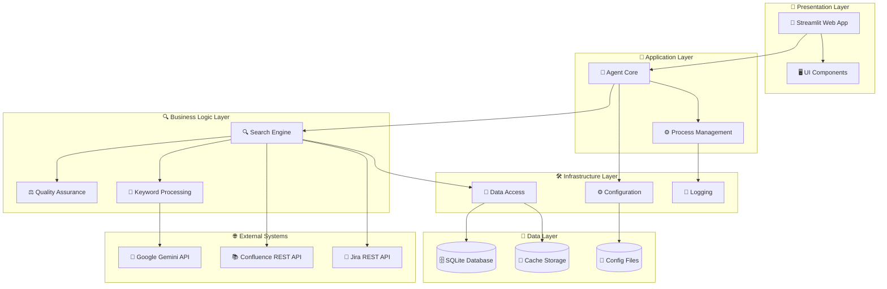

---

## 📦 **2. 詳細コンポーネント分解**

### **2.1 プレゼンテーション層コンポーネント**
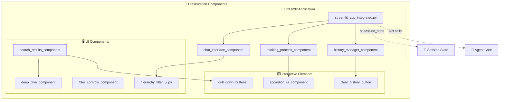

### **2.2 アプリケーション層コンポーネント**
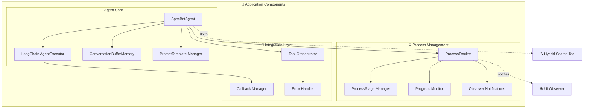

### **2.3 ビジネスロジック層コンポーネント**
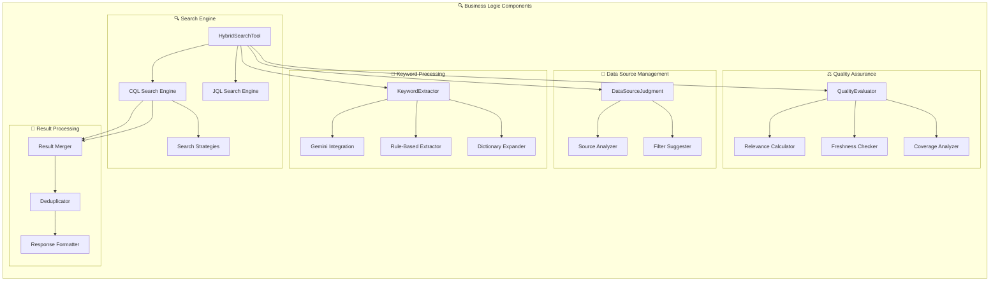

### **2.4 インフラストラクチャ層コンポーネント**
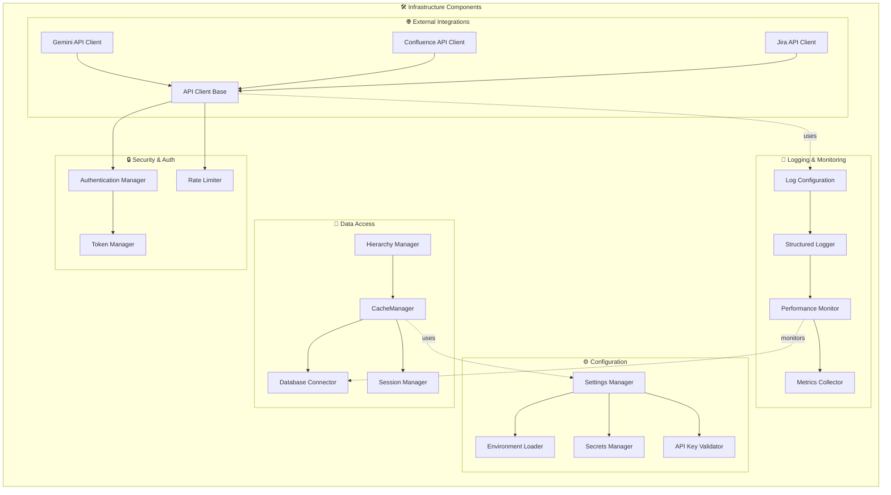

---

## 🔗 **3. コンポーネント間依存関係**

### **3.1 依存関係マトリックス**
| Component | Depends On | Dependency Type |
|-----------|------------|-----------------|
| StreamlitApp | SpecBotAgent | uses |
| SpecBotAgent | HybridSearchTool | aggregates |
| HybridSearchTool | KeywordExtractor, CQLSearch | composes |
| KeywordExtractor | GeminiClient | uses |
| CQLSearch | ConfluenceClient | uses |
| CacheManager | DatabaseConnector | composes |
| SettingsManager | EnvLoader | uses |

### **3.2 インターフェース定義**
```mermaid
graph LR
    subgraph "🔌 Component Interfaces"
        ISearchTool[<<interface>> ISearchTool]
        IAPIClient[<<interface>> IAPIClient]
        ICacheManager[<<interface>> ICacheManager]
        IQualityEvaluator[<<interface>> IQualityEvaluator]
        IProcessObserver[<<interface>> IProcessObserver]
    end

    subgraph "💡 Implementation Classes"
        HybridSearchTool[HybridSearchTool]
        GeminiClient[GeminiAPIClient]
        CacheManager[CacheManager]
        QualityEvaluator[QualityEvaluator]
        UIObserver[StreamlitUIObserver]
    end

    %% Interface implementations
    ISearchTool <|.. HybridSearchTool
    IAPIClient <|.. GeminiClient
    ICacheManager <|.. CacheManager
    IQualityEvaluator <|.. QualityEvaluator
    IProcessObserver <|.. UIObserver
```

---

## 📍 **4. 配置・デプロイメント構成**

### **4.1 物理配置図**
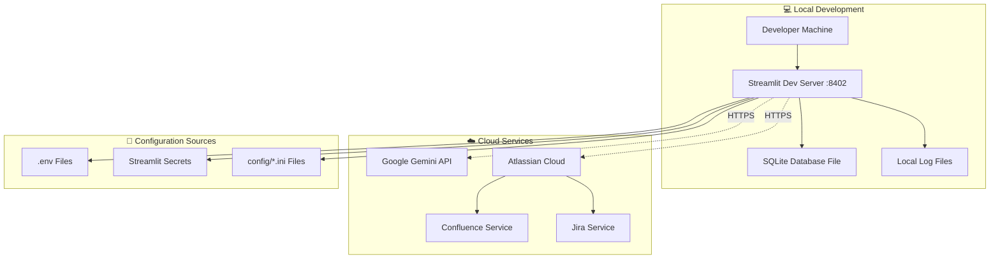

### **4.2 コンポーネント配置マッピング**
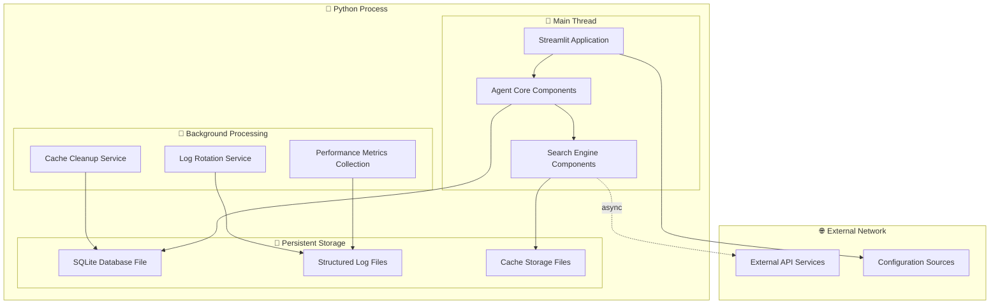

---

## ⚡ **5. パフォーマンス・スケーラビリティ考慮**

### **5.1 コンポーネント負荷分散**
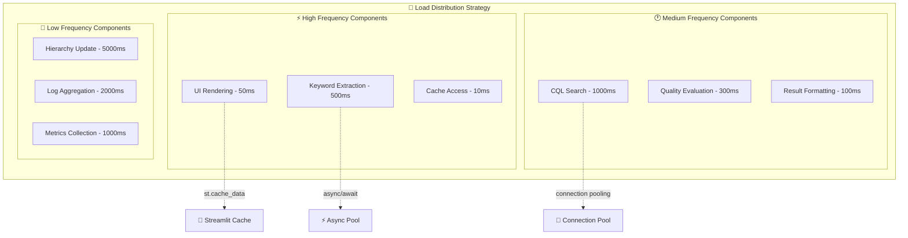

### **5.2 メモリー・リソース管理**
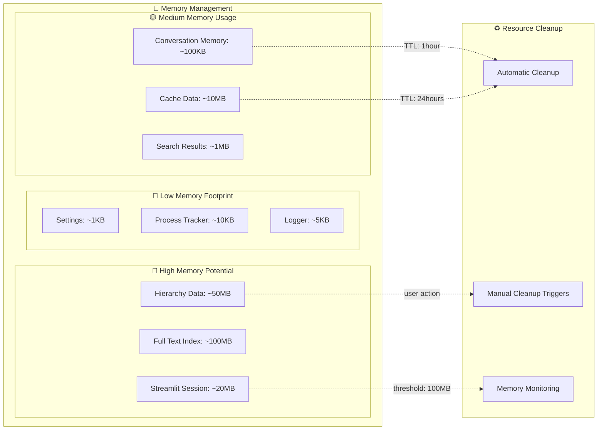

---

## 🔒 **6. セキュリティ・コンプライアンス**

### **6.1 セキュリティコンポーネント配置**
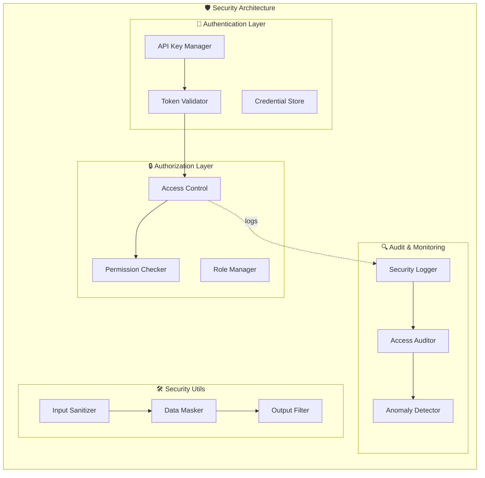

---

## 🚀 **7. 拡張性・将来対応**

### **7.1 Phase 2.2拡張準備**
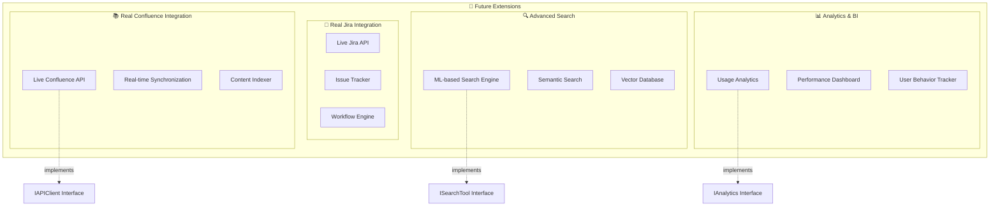

### **7.2 プラグイン・モジュラー設計**
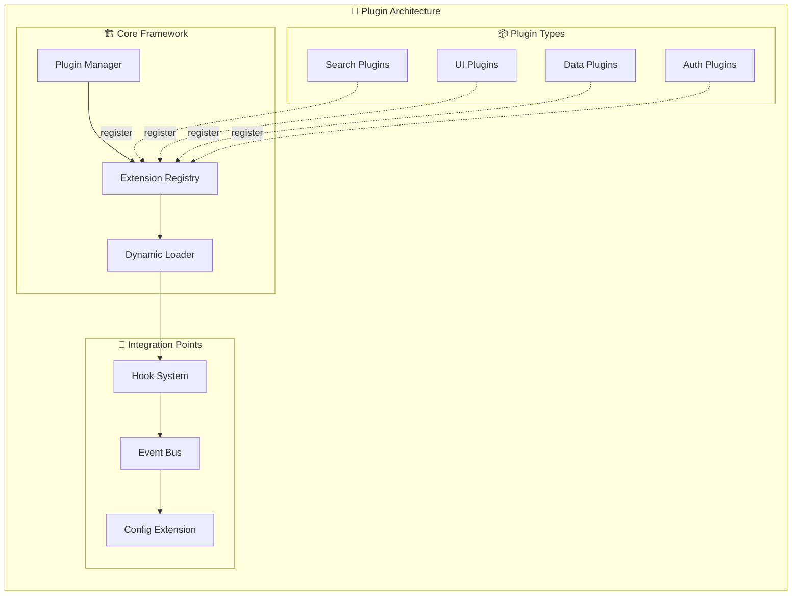

---

*最終更新: 2025年1月24日 - v1.0 コンポーネント構成完成版* 