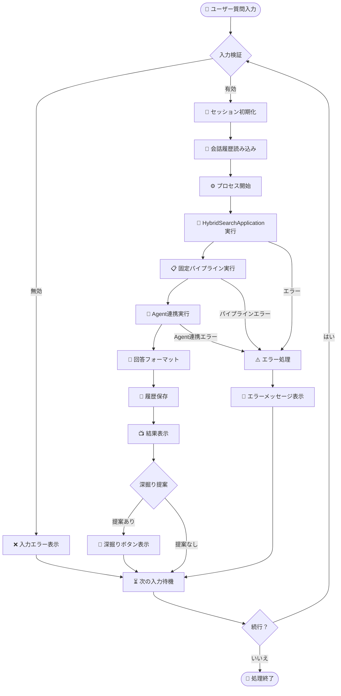
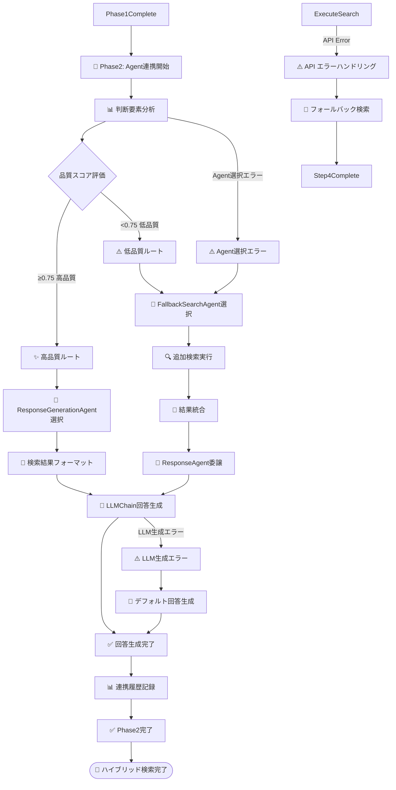
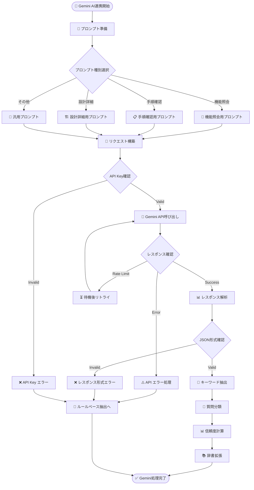
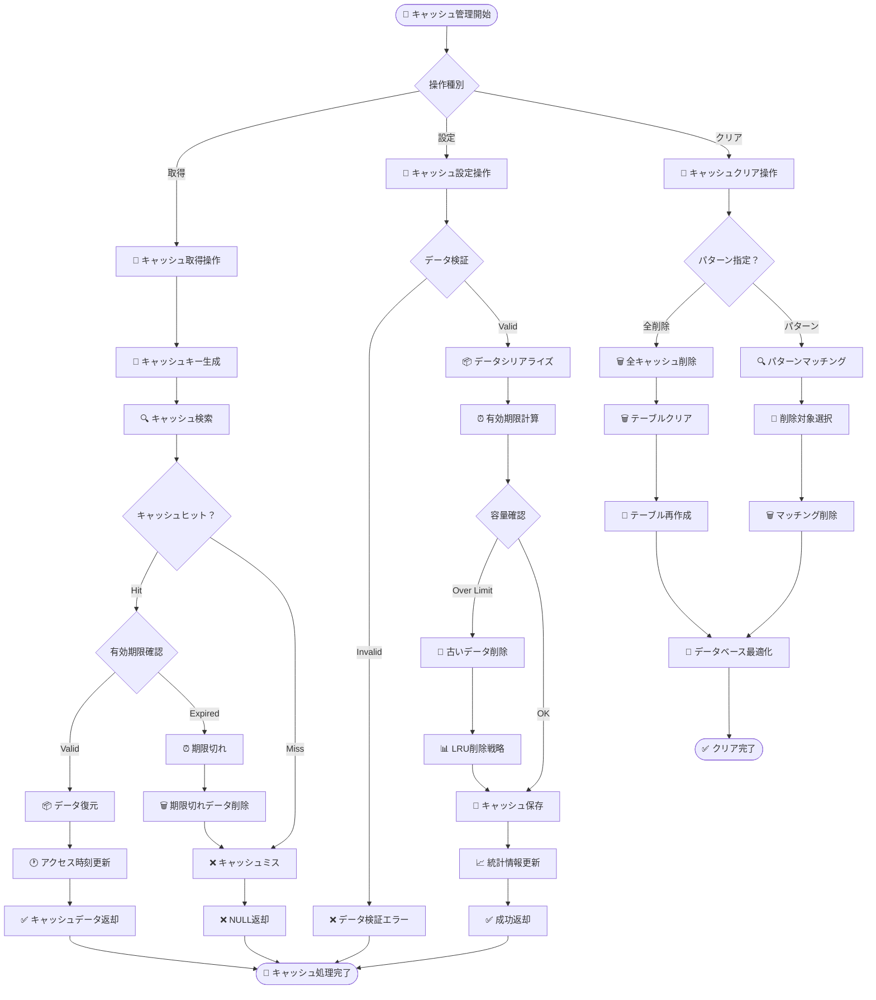
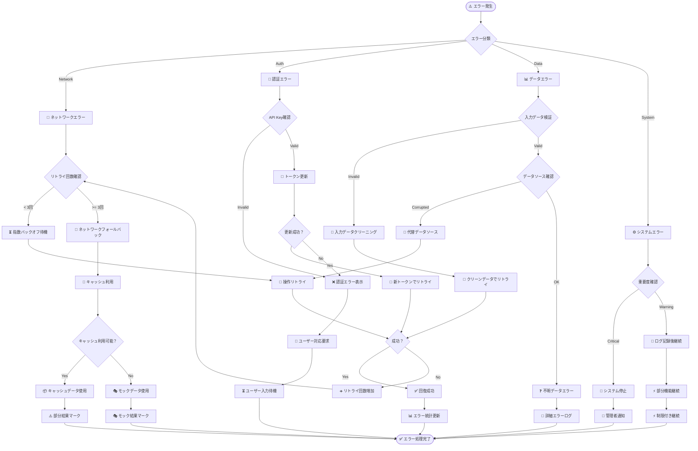
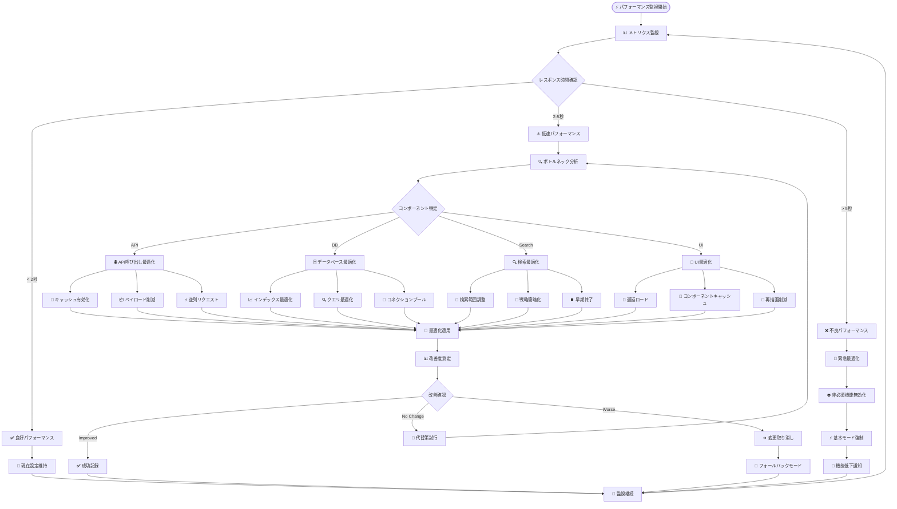
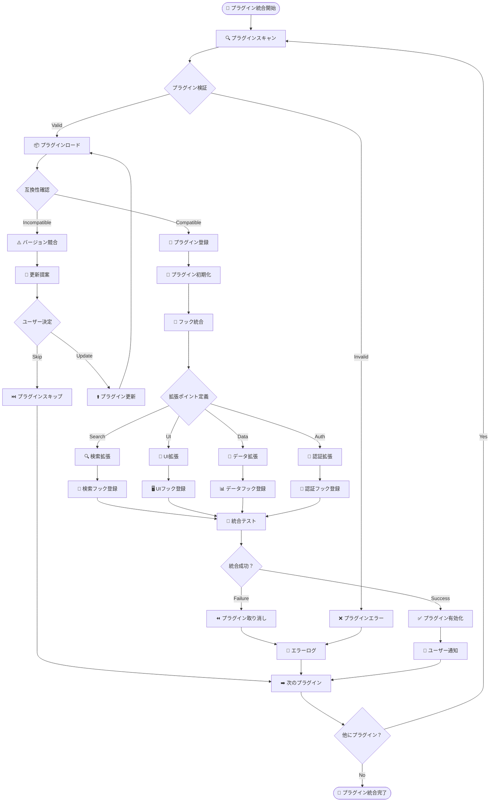

# SPEC-DS-005D アクティビティ図設計書

| バージョン | ステータス | 作成日 | 参照ドキュメント |
| :--- | :--- | :--- | :--- |
| **v1.0** | **最新版** | 2025/01/24 | SPEC-DS-005A クラス図設計書, SPEC-DS-005B シーケンス図設計書, SPEC-DS-005C コンポーネント図設計書 |

---

## 🔄 **概要**
本ドキュメントは、「仕様書作成支援ボット」の業務プロセス・制御フロー・分岐ロジックをUMLアクティビティ図で詳細に定義するものである。処理の流れ・意思決定ポイント・並列処理・例外処理を明確化する。

---

## 🎯 **1. メイン業務フロー - ユーザー質問処理**

### **1.1 全体業務フロー**


---

## 🔍 **2. ハイブリッド検索詳細フロー**

### **2.1 Phase1: 固定検索パイプライン (Step2-5)**
```mermaid
flowchart TD
    SearchStart([🔍 ハイブリッド検索開始]) --> PhaseCheck[🎯 Phase判定]
    PhaseCheck --> Phase1Start[📋 Phase1: 固定パイプライン開始]
    
    %% Step1: フィルタ機能（UI処理済み）
    Phase1Start --> Step1Note[📝 Step1: フィルタ機能（UI処理済み）]
    Step1Note --> Step2Start[🔍 Step2開始: キーワード抽出]
    
    %% Step2: キーワード抽出
    Step2Start --> CheckGemini{Gemini API利用可能？}
    CheckGemini -->|Yes| GeminiExtract[🤖 Gemini AIによる抽出]
    CheckGemini -->|No| RuleExtract[📋 ルールベース抽出]
    
    GeminiExtract --> GeminiSuccess{抽出成功？}
    GeminiSuccess -->|Yes| Step2Complete[✅ Step2完了]
    GeminiSuccess -->|No| FallbackToRules[🔄 ルールベースにフォールバック]
    FallbackToRules --> Step2Complete
    RuleExtract --> Step2Complete
    
    %% Step3: データソース判定  
    Step2Complete --> Step3Start[🎯 Step3開始: データソース判定]
    Step3Start --> AnalyzeKeywords[🔍 キーワード文脈分析]
    AnalyzeKeywords --> CalculateConfidence[📊 信頼度計算]
    CalculateConfidence --> ConfidenceCheck{信頼度 > 0.7？}
    
    ConfidenceCheck -->|Yes| PrimarySource[✅ 主要データソース決定]
    ConfidenceCheck -->|No| BothSources[🔄 両方検索]
    PrimarySource --> Step3Complete[✅ Step3完了]
    BothSources --> Step3Complete
    
    %% Step4: CQL検索実行
    Step3Complete --> Step4Start[🔍 Step4開始: CQL検索実行]
    
    Step4Start --> CheckCache{キャッシュ確認}
    CheckCache -->|Hit| CacheResult[💾 キャッシュから結果取得]
    CheckCache -->|Miss| ExecuteSearch[🌐 実際の検索実行]
    
    CacheResult --> Step4Complete[✅ Step4完了]
    
    ExecuteSearch --> ParallelSearch{並列検索実行}
    
    %% 並列検索戦略
    subgraph "⚡ 並列検索戦略"
        Strategy1[🎯 Strategy1: タイトル優先]
        Strategy2[🔍 Strategy2: キーワード分割]
        Strategy3[📝 Strategy3: フレーズ検索]
    end
    
    ParallelSearch --> Strategy1
    ParallelSearch --> Strategy2
    ParallelSearch --> Strategy3
    
    Strategy1 --> MergeResults[🔄 結果統合]
    Strategy2 --> MergeResults
    Strategy3 --> MergeResults
    
    MergeResults --> Deduplicate[🎯 重複除去]
    Deduplicate --> CacheStore[💾 結果をキャッシュ]
    CacheStore --> Step4Complete
    
    %% Step5: 品質評価
    Step4Complete --> Step5Start[⚖️ Step5開始: 品質評価]
    Step5Start --> EvaluateQuality[📊 3軸品質評価]
    
    %% 品質評価の詳細（3軸評価）
    EvaluateQuality --> ReliabilityScore[🔐 信頼性スコア (40%)]
    EvaluateQuality --> RelevanceScore[🎯 関連度スコア (50%)]
    EvaluateQuality --> EffectivenessScore[⚡ 有効性スコア (10%)]
    
    ReliabilityScore --> QualityMerge[🔄 品質スコア統合]
    RelevanceScore --> QualityMerge
    EffectivenessScore --> QualityMerge
    
    QualityMerge --> Step5Complete[✅ Step5完了]
    Step5Complete --> Phase1Complete[✅ Phase1完了]
```

### **2.2 Phase2: Agent連携システム**


---

## 🤖 **3. Gemini API連携フロー**

### **3.1 AI支援キーワード抽出プロセス**


---

## 💾 **4. キャッシュ管理フロー**

### **4.1 インテリジェントキャッシュ戦略**


---

## 🎨 **5. UI更新・インタラクションフロー**

### **5.1 リアルタイムUI更新プロセス**
```mermaid
flowchart TD
    UIStart([🎨 UI更新開始]) --> CheckUpdateType{更新種別}
    
    %% 思考プロセス更新
    CheckUpdateType -->|思考プロセス| ThinkingUpdate[🧠 思考プロセス更新]
    ThinkingUpdate --> GetProcessState[📊 プロセス状態取得]
    GetProcessState --> RenderAccordion[🎯 アコーディオン描画]
    
    RenderAccordion --> CheckStageStatus{段階ステータス確認}
    CheckStageStatus -->|進行中| ShowProgress[⏳ 進行中表示]
    CheckStageStatus -->|完了| ShowComplete[✅ 完了表示]
    CheckStageStatus -->|エラー| ShowError[❌ エラー表示]
    
    ShowProgress --> UpdateUIState[🔄 UI状態更新]
    ShowComplete --> UpdateUIState
    ShowError --> UpdateUIState
    
    UpdateUIState --> TriggerRerun[🔄 st.rerun() 実行]
    
    %% 会話履歴更新
    CheckUpdateType -->|会話履歴| HistoryUpdate[📝 会話履歴更新]
    HistoryUpdate --> AddToHistory[➕ 履歴に追加]
    AddToHistory --> CheckHistoryLimit{履歴上限確認}
    
    CheckHistoryLimit -->|Over Limit| TrimHistory[✂️ 古い履歴削除]
    CheckHistoryLimit -->|OK| RenderHistory[📋 履歴描画]
    TrimHistory --> RenderHistory
    
    RenderHistory --> UpdateConversationCount[🔢 会話数更新]
    UpdateConversationCount --> ShowClearButton{クリアボタン表示判定}
    
    ShowClearButton -->|表示| RenderClearButton[🧹 クリアボタン描画]
    ShowClearButton -->|非表示| SkipClearButton[⏭️ ボタンスキップ]
    
    RenderClearButton --> TriggerRerun
    SkipClearButton --> TriggerRerun
    
    %% 検索結果更新
    CheckUpdateType -->|検索結果| ResultsUpdate[🔍 検索結果更新]
    ResultsUpdate --> FormatResults[📝 結果フォーマット]
    FormatResults --> RenderSources[📚 ソース情報描画]
    RenderSources --> GenerateDeepDive[🔗 深掘りキーワード生成]
    
    GenerateDeepDive --> CheckRelatedKeywords{関連キーワード存在？}
    CheckRelatedKeywords -->|あり| RenderDrillDown[🎯 深掘りボタン描画]
    CheckRelatedKeywords -->|なし| SkipDrillDown[⏭️ ボタンスキップ]
    
    RenderDrillDown --> TriggerRerun
    SkipDrillDown --> TriggerRerun
    
    %% エラー更新
    CheckUpdateType -->|エラー| ErrorUpdate[⚠️ エラー表示更新]
    ErrorUpdate --> ClassifyError{エラー分類}
    
    ClassifyError -->|API Error| ShowAPIError[🌐 API エラー表示]
    ClassifyError -->|Network Error| ShowNetworkError[📡 ネットワークエラー表示]
    ClassifyError -->|System Error| ShowSystemError[⚙️ システムエラー表示]
    
    ShowAPIError --> AddErrorToHistory[📝 エラー履歴追加]
    ShowNetworkError --> AddErrorToHistory
    ShowSystemError --> AddErrorToHistory
    
    AddErrorToHistory --> TriggerRerun
    
    TriggerRerun --> UIEnd([🏁 UI更新完了])
```

---

## 🔄 **6. エラーハンドリング・回復フロー**

### **6.1 多層エラーハンドリング戦略**


---

## ⚡ **7. パフォーマンス最適化フロー**

### **7.1 動的パフォーマンス調整**


---

## 🚀 **8. 将来拡張・プラグイン統合フロー**

### **8.1 プラグイン動的統合プロセス**


---

*最終更新: 2025年1月24日 - v1.0 業務フロー完成版* 