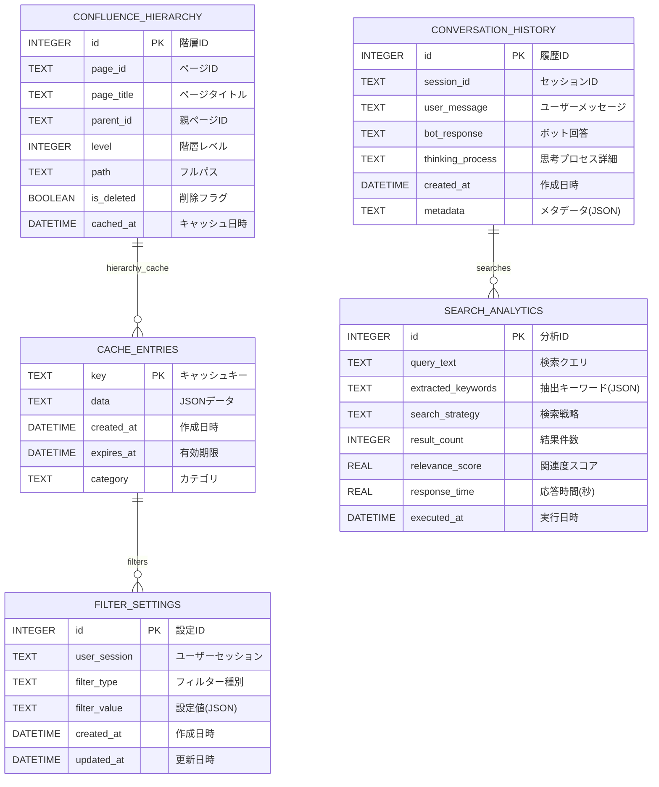

# SPEC-DS-006 データベース設計書

| バージョン | ステータス | 作成日 | 参照ドキュメント |
| :--- | :--- | :--- | :--- |
| **v1.0** | **最新版** | 2025/01/24 | SPEC-DS-001 開発設計書, SPEC-DS-005 UML設計書 |

---

## 🗄️ **概要**
本ドキュメントは、「仕様書作成支援ボット」で使用するデータベース（SQLite）の論理設計・物理設計・テーブル構造を定義するものである。主にキャッシュデータ、会話履歴、フィルター設定の永続化を担う。

---

## 📊 **1. データベース概要**

### **1.1 データベース仕様**
- **DBMS**: SQLite 3.x
- **ファイル場所**: `{project_root}/cache/filter_cache.db`
- **文字コード**: UTF-8
- **主要目的**: パフォーマンス向上・ユーザー体験改善

### **1.2 設計方針**
1. **軽量性**: SQLiteによる軽量なファイルベースDB
2. **高速性**: インデックス最適化による高速クエリ
3. **拡張性**: 将来的な機能追加に対応可能な設計
4. **保守性**: シンプルなテーブル構造・明確な命名規則

---

## 🏗️ **2. 論理設計**

### **2.1 エンティティ関係図 (ER図)**


### **2.2 エンティティ定義**

#### **CACHE_ENTRIES (キャッシュエントリ)**
- **目的**: API結果のキャッシュ・パフォーマンス向上
- **データ量**: 中量（数百～数千レコード）
- **更新頻度**: 高頻度（1時間ごと）

#### **CONVERSATION_HISTORY (会話履歴)**
- **目的**: ユーザー会話の永続化・文脈保持
- **データ量**: 中量（数十～数百レコード/ユーザー）
- **更新頻度**: 低頻度（質問ごと）

#### **FILTER_SETTINGS (フィルター設定)**
- **目的**: ユーザー個別フィルター設定の保存
- **データ量**: 小量（数十レコード/ユーザー）
- **更新頻度**: 低頻度（設定変更時）

#### **SEARCH_ANALYTICS (検索分析)**
- **目的**: 検索パフォーマンス分析・改善指標
- **データ量**: 大量（数千～数万レコード）
- **更新頻度**: 高頻度（検索ごと）

#### **CONFLUENCE_HIERARCHY (Confluence階層)**
- **目的**: ページ階層構造の高速フィルタリング
- **データ量**: 中量（数百～数千レコード）
- **更新頻度**: 低頻度（日次更新）

---

## 🔧 **3. 物理設計**

### **3.1 CREATE TABLE文**

#### **3.1.1 CACHE_ENTRIES テーブル**
```sql
CREATE TABLE IF NOT EXISTS cache_entries (
    key TEXT PRIMARY KEY,
    data TEXT NOT NULL,
    created_at DATETIME DEFAULT CURRENT_TIMESTAMP,
    expires_at DATETIME NOT NULL,
    category TEXT DEFAULT 'general',
    CHECK (length(key) <= 255),
    CHECK (expires_at > created_at)
);

-- インデックス
CREATE INDEX idx_cache_expires ON cache_entries(expires_at);
CREATE INDEX idx_cache_category ON cache_entries(category);
```

#### **3.1.2 CONVERSATION_HISTORY テーブル**
```sql
CREATE TABLE IF NOT EXISTS conversation_history (
    id INTEGER PRIMARY KEY AUTOINCREMENT,
    session_id TEXT NOT NULL,
    user_message TEXT NOT NULL,
    bot_response TEXT NOT NULL,
    thinking_process TEXT,
    created_at DATETIME DEFAULT CURRENT_TIMESTAMP,
    metadata TEXT DEFAULT '{}',
    CHECK (length(session_id) <= 255),
    CHECK (length(user_message) > 0),
    CHECK (json_valid(metadata))
);

-- インデックス
CREATE INDEX idx_conv_session ON conversation_history(session_id);
CREATE INDEX idx_conv_created ON conversation_history(created_at DESC);
```

#### **3.1.3 FILTER_SETTINGS テーブル**
```sql
CREATE TABLE IF NOT EXISTS filter_settings (
    id INTEGER PRIMARY KEY AUTOINCREMENT,
    user_session TEXT NOT NULL,
    filter_type TEXT NOT NULL,
    filter_value TEXT NOT NULL DEFAULT '{}',
    created_at DATETIME DEFAULT CURRENT_TIMESTAMP,
    updated_at DATETIME DEFAULT CURRENT_TIMESTAMP,
    CHECK (length(user_session) <= 255),
    CHECK (filter_type IN ('jira', 'confluence', 'global')),
    CHECK (json_valid(filter_value)),
    UNIQUE(user_session, filter_type)
);

-- インデックス
CREATE INDEX idx_filter_session ON filter_settings(user_session);
CREATE INDEX idx_filter_type ON filter_settings(filter_type);

-- 更新時のトリガー
CREATE TRIGGER update_filter_timestamp 
    AFTER UPDATE ON filter_settings
BEGIN
    UPDATE filter_settings SET updated_at = CURRENT_TIMESTAMP WHERE id = NEW.id;
END;
```

#### **3.1.4 SEARCH_ANALYTICS テーブル**
```sql
CREATE TABLE IF NOT EXISTS search_analytics (
    id INTEGER PRIMARY KEY AUTOINCREMENT,
    query_text TEXT NOT NULL,
    extracted_keywords TEXT DEFAULT '[]',
    search_strategy TEXT,
    result_count INTEGER DEFAULT 0,
    relevance_score REAL,
    response_time REAL,
    executed_at DATETIME DEFAULT CURRENT_TIMESTAMP,
    CHECK (length(query_text) > 0),
    CHECK (json_valid(extracted_keywords)),
    CHECK (result_count >= 0),
    CHECK (relevance_score >= 0.0 AND relevance_score <= 1.0),
    CHECK (response_time >= 0.0)
);

-- インデックス
CREATE INDEX idx_analytics_executed ON search_analytics(executed_at DESC);
CREATE INDEX idx_analytics_score ON search_analytics(relevance_score DESC);
CREATE INDEX idx_analytics_strategy ON search_analytics(search_strategy);
```

#### **3.1.5 CONFLUENCE_HIERARCHY テーブル**
```sql
CREATE TABLE IF NOT EXISTS confluence_hierarchy (
    id INTEGER PRIMARY KEY AUTOINCREMENT,
    page_id TEXT NOT NULL UNIQUE,
    page_title TEXT NOT NULL,
    parent_id TEXT,
    level INTEGER DEFAULT 0,
    path TEXT,
    is_deleted BOOLEAN DEFAULT FALSE,
    cached_at DATETIME DEFAULT CURRENT_TIMESTAMP,
    CHECK (length(page_id) > 0),
    CHECK (length(page_title) > 0),
    CHECK (level >= 0),
    FOREIGN KEY (parent_id) REFERENCES confluence_hierarchy(page_id)
);

-- インデックス
CREATE INDEX idx_hierarchy_parent ON confluence_hierarchy(parent_id);
CREATE INDEX idx_hierarchy_level ON confluence_hierarchy(level);
CREATE INDEX idx_hierarchy_deleted ON confluence_hierarchy(is_deleted);
CREATE INDEX idx_hierarchy_path ON confluence_hierarchy(path);
```

### **3.2 初期データ投入**
```sql
-- サンプルキャッシュエントリ
INSERT OR IGNORE INTO cache_entries (key, data, expires_at, category) VALUES
('jira_statuses', '["To Do", "In Progress", "Done"]', datetime('now', '+24 hours'), 'jira'),
('confluence_spaces', '["CLIENTTOMO", "DEV", "QA"]', datetime('now', '+24 hours'), 'confluence');

-- デフォルトフィルター設定
INSERT OR IGNORE INTO filter_settings (user_session, filter_type, filter_value) VALUES
('default', 'confluence', '{"include_deleted": false, "default_space": "CLIENTTOMO"}'),
('default', 'jira', '{"default_project": "CTJ", "max_results": 50}');
```

---

## 📈 **4. パフォーマンス設計**

### **4.1 インデックス戦略**
```sql
-- 複合インデックス（頻繁なクエリパターン用）
CREATE INDEX idx_cache_category_expires ON cache_entries(category, expires_at);
CREATE INDEX idx_conv_session_created ON conversation_history(session_id, created_at DESC);
CREATE INDEX idx_hierarchy_parent_level ON confluence_hierarchy(parent_id, level);

-- 部分インデックス（条件付きクエリ用）
CREATE INDEX idx_hierarchy_active ON confluence_hierarchy(page_id) WHERE is_deleted = FALSE;
CREATE INDEX idx_cache_valid ON cache_entries(key) WHERE expires_at > CURRENT_TIMESTAMP;
```

### **4.2 クエリ最適化例**
```sql
-- 1. 有効なキャッシュ取得（最頻繁クエリ）
SELECT data FROM cache_entries 
WHERE key = ? AND expires_at > CURRENT_TIMESTAMP;

-- 2. セッション別会話履歴（ページネーション対応）
SELECT user_message, bot_response, created_at 
FROM conversation_history 
WHERE session_id = ? 
ORDER BY created_at DESC 
LIMIT ? OFFSET ?;

-- 3. 階層フィルタリング（アクティブページのみ）
SELECT page_id, page_title, level, path 
FROM confluence_hierarchy 
WHERE parent_id = ? AND is_deleted = FALSE 
ORDER BY level, page_title;

-- 4. 検索パフォーマンス分析
SELECT 
    search_strategy,
    AVG(relevance_score) as avg_relevance,
    AVG(response_time) as avg_response_time,
    COUNT(*) as query_count
FROM search_analytics 
WHERE executed_at >= datetime('now', '-7 days')
GROUP BY search_strategy
ORDER BY avg_relevance DESC;
```

---

## 🔒 **5. データ整合性・制約**

### **5.1 制約定義**
```sql
-- 1. データ型制約
ALTER TABLE cache_entries ADD CONSTRAINT chk_expires_future 
CHECK (expires_at > created_at);

-- 2. 参照整合性
ALTER TABLE confluence_hierarchy ADD CONSTRAINT fk_parent_exists
FOREIGN KEY (parent_id) REFERENCES confluence_hierarchy(page_id);

-- 3. 値範囲制約  
ALTER TABLE search_analytics ADD CONSTRAINT chk_score_range
CHECK (relevance_score >= 0.0 AND relevance_score <= 1.0);

-- 4. JSON形式制約
ALTER TABLE filter_settings ADD CONSTRAINT chk_json_valid
CHECK (json_valid(filter_value));
```

### **5.2 データクリーンアップ**
```sql
-- 期限切れキャッシュの自動削除
CREATE TRIGGER cleanup_expired_cache
    AFTER INSERT ON cache_entries
BEGIN
    DELETE FROM cache_entries WHERE expires_at <= CURRENT_TIMESTAMP;
END;

-- 古い会話履歴の定期削除（30日以上前）
DELETE FROM conversation_history 
WHERE created_at < datetime('now', '-30 days');

-- 古い検索分析データの定期削除（90日以上前）
DELETE FROM search_analytics 
WHERE executed_at < datetime('now', '-90 days');
```

---

## 💾 **6. バックアップ・メンテナンス**

### **6.1 バックアップ戦略**
```sql
-- 1. 完全バックアップ（日次）
.backup cache/filter_cache_backup_$(date +%Y%m%d).db

-- 2. 重要データのみバックアップ
CREATE TABLE backup_conversation_history AS 
SELECT * FROM conversation_history WHERE created_at >= datetime('now', '-7 days');

-- 3. 設定データのエクスポート
.mode json
.output filter_settings_backup.json
SELECT * FROM filter_settings;
```

### **6.2 メンテナンス操作**
```sql
-- 1. VACUUM（定期実行）
VACUUM;

-- 2. インデックス再構築
REINDEX;

-- 3. 統計情報更新
ANALYZE;

-- 4. データベース整合性チェック
PRAGMA integrity_check;

-- 5. データベースサイズ確認
PRAGMA page_count;
PRAGMA page_size;
```

---

## 📊 **7. 使用例・アクセスパターン**

### **7.1 CacheManagerクラスでの利用**
```python
# キャッシュ取得
def get_cached_data(self, key: str) -> Optional[Any]:
    with self._get_connection() as conn:
        cursor = conn.execute(
            "SELECT data FROM cache_entries WHERE key = ? AND expires_at > CURRENT_TIMESTAMP",
            (key,)
        )
        result = cursor.fetchone()
        return json.loads(result[0]) if result else None

# キャッシュ設定
def set_cached_data(self, key: str, data: Any, expiry_hours: int = 24):
    expires_at = datetime.now() + timedelta(hours=expiry_hours)
    with self._get_connection() as conn:
        conn.execute(
            "INSERT OR REPLACE INTO cache_entries (key, data, expires_at) VALUES (?, ?, ?)",
            (key, json.dumps(data), expires_at)
        )
```

### **7.2 会話履歴管理**
```python
# 履歴保存
def save_conversation(self, session_id: str, user_msg: str, bot_response: str, thinking: str):
    with self._get_connection() as conn:
        conn.execute(
            "INSERT INTO conversation_history (session_id, user_message, bot_response, thinking_process) VALUES (?, ?, ?, ?)",
            (session_id, user_msg, bot_response, thinking)
        )

# 履歴取得
def get_conversation_history(self, session_id: str, limit: int = 10) -> List[Dict]:
    with self._get_connection() as conn:
        cursor = conn.execute(
            "SELECT user_message, bot_response, created_at FROM conversation_history WHERE session_id = ? ORDER BY created_at DESC LIMIT ?",
            (session_id, limit)
        )
        return [{"user": row[0], "bot": row[1], "timestamp": row[2]} for row in cursor.fetchall()]
```

---

## 🚀 **8. 将来拡張計画**

### **8.1 Phase 2.2対応準備**
```sql
-- 実Confluence連携用テーブル
CREATE TABLE IF NOT EXISTS confluence_pages (
    id TEXT PRIMARY KEY,
    title TEXT NOT NULL,
    content TEXT,
    space_key TEXT NOT NULL,
    version INTEGER,
    last_modified DATETIME,
    author TEXT,
    url TEXT
);

-- 実Jira連携用テーブル  
CREATE TABLE IF NOT EXISTS jira_issues (
    key TEXT PRIMARY KEY,
    summary TEXT NOT NULL,
    description TEXT,
    status TEXT NOT NULL,
    assignee TEXT,
    project_key TEXT NOT NULL,
    created DATETIME,
    updated DATETIME
);
```

### **8.2 分析機能強化**
```sql
-- ユーザー行動分析
CREATE TABLE IF NOT EXISTS user_analytics (
    id INTEGER PRIMARY KEY AUTOINCREMENT,
    session_id TEXT NOT NULL,
    action_type TEXT NOT NULL,
    action_detail TEXT,
    timestamp DATETIME DEFAULT CURRENT_TIMESTAMP
);

-- 検索改善提案
CREATE VIEW search_improvement_suggestions AS
SELECT 
    query_text,
    AVG(relevance_score) as avg_score,
    COUNT(*) as usage_count
FROM search_analytics 
WHERE relevance_score < 0.7
GROUP BY query_text
HAVING usage_count > 1
ORDER BY usage_count DESC;
```

---

*最終更新: 2025年1月24日 - v1.0 システム完成版* 