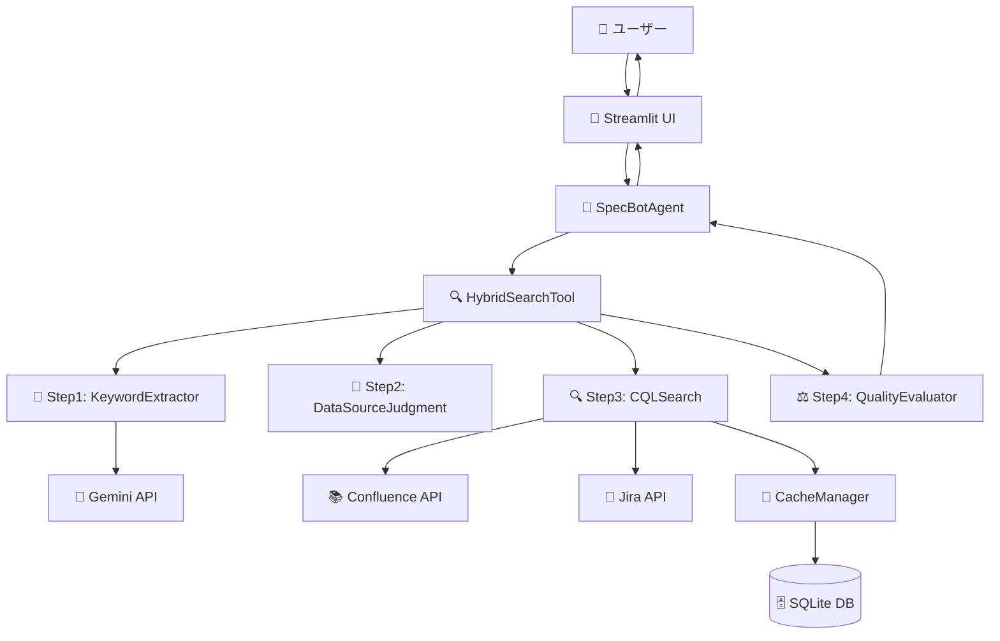
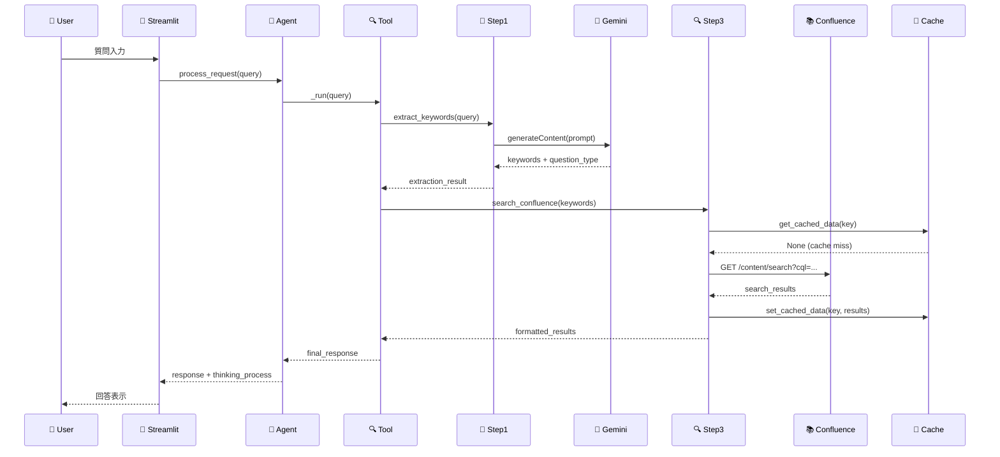

# SPEC-DS-007 API設計書

| バージョン | ステータス | 作成日 | 参照ドキュメント |
| :--- | :--- | :--- | :--- |
| **v1.0** | **最新版** | 2025/01/24 | SPEC-DS-001 開発設計書, SPEC-DS-005 UML設計書, SPEC-DS-006 データベース設計書 |

---

## 🌐 **概要**
本ドキュメントは、「仕様書作成支援ボット」の内部API・外部API・データフローを定義するものである。モジュール間通信、外部システム連携、エラーハンドリング等の詳細仕様を明確化する。

---

## 🏗️ **1. API全体アーキテクチャ**

### **1.1 API層構成**
```
┌─────────────────────────────────────────────────────────────┐
│                    🎨 Presentation API                     │
│         Streamlit Web Interface (HTTP REST-like)           │
├─────────────────────────────────────────────────────────────┤
│                    🧠 Application API                      │
│     SpecBotAgent.process_request() - Main Entry Point     │
├─────────────────────────────────────────────────────────────┤
│                    🔍 Business Logic API                   │
│  Step1-4 APIs + HybridSearchTool + ProcessTracker APIs   │
├─────────────────────────────────────────────────────────────┤
│                    🛠️ Infrastructure API                   │
│    CacheManager + Settings + External API Clients        │
├─────────────────────────────────────────────────────────────┤
│                    🌐 External APIs                        │
│      Gemini AI + Confluence REST + Jira REST APIs        │
└─────────────────────────────────────────────────────────────┘
```

### **1.2 API通信プロトコル**
- **内部API**: Python関数呼び出し（同期・非同期）
- **外部API**: HTTPS REST API (JSON形式)
- **認証方式**: API Key認証 (外部API)
- **エラーハンドリング**: 例外ベース + ステータスコード

---

## 🔌 **2. 内部API仕様**

### **2.1 SpecBotAgent API**

#### **2.1.1 メイン処理API**
```python
class SpecBotAgent:
    def process_request(self, user_input: str, **kwargs) -> Dict[str, Any]:
        """
        ユーザー質問の処理エントリーポイント
        
        Args:
            user_input (str): ユーザーからの質問文
            **kwargs: 追加パラメータ (filters, session_id等)
            
        Returns:
            Dict[str, Any]: {
                "response": str,           # 最終回答
                "thinking_process": Dict,  # 思考プロセス詳細
                "sources": List[Dict],     # 参照元情報
                "metadata": Dict          # メタデータ
            }
            
        Raises:
            ValueError: 入力パラメータエラー
            APIError: 外部API接続エラー
            ProcessingError: 処理中エラー
        """
    
    def get_conversation_history(self, session_id: str = None) -> List[Dict]:
        """
        会話履歴の取得
        
        Args:
            session_id (str, optional): セッションID
            
        Returns:
            List[Dict]: [
                {
                    "user_message": str,
                    "bot_response": str,
                    "timestamp": datetime,
                    "thinking_process": Dict
                }
            ]
        """
    
    def clear_conversation_history(self, session_id: str = None) -> bool:
        """
        会話履歴のクリア
        
        Args:
            session_id (str, optional): セッションID
            
        Returns:
            bool: 成功/失敗
        """
```

### **2.2 HybridSearchTool API**
```python
class HybridSearchTool:
    def _run(self, query: str, **kwargs) -> str:
        """
        ハイブリッド検索の実行
        
        Args:
            query (str): 検索クエリ
            **kwargs: フィルター条件等
            
        Returns:
            str: フォーマット済み回答
            
        Raises:
            SearchError: 検索エラー
            QualityError: 品質評価エラー
        """
    
    def _execute_hybrid_search(self, query: str) -> Dict[str, Any]:
        """
        内部ハイブリッド検索処理
        
        Returns:
            Dict[str, Any]: {
                "step1_result": Dict,  # キーワード抽出結果
                "step2_result": Dict,  # データソース判定結果  
                "step3_result": Dict,  # CQL検索結果
                "step4_result": Dict   # 品質評価結果
            }
        """
```

### **2.3 Step1-4 Processing APIs**

#### **Step1: KeywordExtractor API**
```python
class KeywordExtractor:
    def extract_keywords(self, query: str) -> Dict[str, Any]:
        """
        キーワード抽出の実行
        
        Args:
            query (str): 元の質問文
            
        Returns:
            Dict[str, Any]: {
                "keywords": List[str],           # 抽出キーワード
                "question_type": str,            # 質問分類
                "confidence": float,             # 抽出信頼度
                "excluded_terms": List[str],     # 除外した汎用句
                "extraction_method": str         # 抽出手法("gemini"|"rules")
            }
        """
    
    def _classify_question_type(self, query: str) -> str:
        """
        質問タイプの分類
        
        Returns:
            str: "機能照会"|"手順確認"|"設計詳細"|"トラブル対応"|"仕様変更"|"全般質問"
        """
```

#### **Step2: DataSourceJudgment API**
```python
class DataSourceJudgment:
    def judge_optimal_datasource(self, keywords: List[str], question_type: str) -> Dict[str, Any]:
        """
        最適データソースの判定
        
        Args:
            keywords (List[str]): 抽出済みキーワード
            question_type (str): 質問分類
            
        Returns:
            Dict[str, Any]: {
                "primary_source": str,      # "confluence"|"jira"|"both"
                "confidence": float,        # 判定信頼度
                "reasoning": str,           # 判定理由
                "suggested_filters": Dict   # 推奨フィルター
            }
        """
```

#### **Step3: CQLSearch API**
```python
class CQLSearch:
    def search_confluence(self, keywords: List[str], filters: Dict = None) -> Dict[str, Any]:
        """
        Confluence CQL検索の実行
        
        Args:
            keywords (List[str]): 検索キーワード
            filters (Dict, optional): フィルター条件
            
        Returns:
            Dict[str, Any]: {
                "results": List[Dict],         # 検索結果
                "strategy_results": Dict,      # 戦略別結果
                "total_found": int,            # 総件数
                "execution_time": float        # 実行時間
            }
        """
    
    def _execute_strategy1(self, keywords: List[str]) -> List[Dict]:
        """Strategy1: タイトル優先検索"""
    
    def _execute_strategy2(self, keywords: List[str]) -> List[Dict]:
        """Strategy2: キーワード分割検索 (AND + OR)"""
    
    def _execute_strategy3(self, keywords: List[str]) -> List[Dict]:
        """Strategy3: フレーズ検索"""
```

#### **Step4: QualityEvaluator API**
```python
class QualityEvaluator:
    def evaluate_search_quality(self, results: List[Dict], keywords: List[str]) -> Dict[str, Any]:
        """
        検索品質の4軸評価
        
        Args:
            results (List[Dict]): 検索結果
            keywords (List[str]): 元キーワード
            
        Returns:
            Dict[str, Any]: {
                "overall_score": float,        # 総合品質スコア
                "relevance_score": float,      # 関連度
                "content_quality": Dict,       # 内容品質
                "freshness": Dict,             # 新鮮度
                "coverage": Dict               # 網羅性
            }
        """
```

### **2.4 Infrastructure APIs**

#### **CacheManager API**
```python
class CacheManager:
    def get_cached_data(self, key: str) -> Optional[Any]:
        """
        キャッシュデータの取得
        
        Args:
            key (str): キャッシュキー
            
        Returns:
            Optional[Any]: キャッシュされたデータ (期限内の場合)
        """
    
    def set_cached_data(self, key: str, data: Any, expiry_hours: int = 24) -> bool:
        """
        キャッシュデータの設定
        
        Args:
            key (str): キャッシュキー
            data (Any): キャッシュするデータ
            expiry_hours (int): 有効期限(時間)
            
        Returns:
            bool: 成功/失敗
        """
    
    def clear_cache(self, pattern: str = None) -> bool:
        """
        キャッシュのクリア
        
        Args:
            pattern (str, optional): キーパターン (None=全削除)
            
        Returns:
            bool: 成功/失敗
        """
```

#### **ProcessTracker API**
```python
class ProcessTracker:
    def start_stage(self, stage_name: str, details: Dict = None) -> None:
        """処理段階の開始"""
    
    def complete_stage(self, stage_name: str, result: Dict) -> None:
        """処理段階の完了"""
    
    def get_progress_summary(self) -> Dict[str, Any]:
        """
        進捗サマリーの取得
        
        Returns:
            Dict[str, Any]: {
                "stages": List[Dict],      # 各段階の詳細
                "current_stage": str,      # 現在の段階
                "overall_progress": float, # 全体進捗率
                "elapsed_time": float      # 経過時間
            }
        """
```

---

## 🌐 **3. 外部API仕様**

### **3.1 Google Gemini API**

#### **3.1.1 API基本情報**
- **エンドポイント**: `https://generativelanguage.googleapis.com/v1/models/gemini-2.5-flash:generateContent`
- **認証**: API Key認証
- **リクエスト制限**: 60 requests/minute
- **最大トークン**: 1,048,576 tokens

#### **3.1.2 リクエスト/レスポンス仕様**
```python
# リクエスト例
POST /v1/models/gemini-2.5-flash:generateContent
{
    "contents": [
        {
            "parts": [
                {
                    "text": "質問文の解析プロンプト..."
                }
            ]
        }
    ],
    "generationConfig": {
        "temperature": 0.1,
        "maxOutputTokens": 2048
    }
}

# レスポンス例
{
    "candidates": [
        {
            "content": {
                "parts": [
                    {
                        "text": "抽出結果..."
                    }
                ]
            },
            "finishReason": "STOP"
        }
    ]
}
```

#### **3.1.3 エラーハンドリング**
```python
class GeminiAPIClient:
    def call_gemini(self, prompt: str, **kwargs) -> str:
        """
        Gemini API呼び出し
        
        Raises:
            APIKeyError: API Key無効
            RateLimitError: レート制限超過
            QuotaExceededError: クォータ超過
            NetworkError: ネットワークエラー
            ParseError: レスポンス解析エラー
        """
```

### **3.2 Confluence REST API**

#### **3.2.1 API基本情報**
- **エンドポイント**: `https://{domain}.atlassian.net/wiki/rest/api/`
- **認証**: Basic認証 (email + API token)
- **バージョン**: v1
- **レート制限**: 300 requests/minute

#### **3.2.2 CQL検索API**
```python
# CQL検索エンドポイント
GET /wiki/rest/api/content/search?cql={cql_query}&limit={limit}&start={start}

# CQLクエリ例
{
    "cql": "space = CLIENTTOMO AND (title ~ \"ログイン\" OR text ~ \"ログイン\")",
    "limit": 25,
    "start": 0,
    "expand": "metadata.labels,space,history.lastUpdated,body.storage"
}

# レスポンス例
{
    "results": [
        {
            "id": "123456",
            "type": "page",
            "title": "ログイン機能仕様書",
            "space": {
                "key": "CLIENTTOMO",
                "name": "クライアント TOMO"
            },
            "history": {
                "lastUpdated": {
                    "when": "2024-12-15T10:30:00.000Z"
                }
            },
            "_links": {
                "webui": "/pages/viewpage.action?pageId=123456"
            }
        }
    ],
    "start": 0,
    "limit": 25,
    "size": 3
}
```

#### **3.2.3 エラーハンドリング**
```python
class ConfluenceAPIClient:
    def search_content(self, cql_query: str, **kwargs) -> Dict[str, Any]:
        """
        Confluence CQL検索
        
        Raises:
            AuthenticationError: 認証エラー
            AuthorizationError: 権限エラー  
            InvalidCQLError: CQLクエリエラー
            SpaceNotFoundError: スペース不存在
            NetworkError: ネットワークエラー
            ServerError: サーバーエラー
        """
```

### **3.3 Jira REST API**

#### **3.3.1 API基本情報**
- **エンドポイント**: `https://{domain}.atlassian.net/rest/api/3/`
- **認証**: Basic認証 (email + API token)
- **バージョン**: v3
- **レート制限**: 300 requests/minute

#### **3.3.2 JQL検索API**
```python
# JQL検索エンドポイント
POST /rest/api/3/search

# リクエスト例
{
    "jql": "project = CTJ AND status IN (\"To Do\", \"In Progress\") AND text ~ \"ログイン\"",
    "maxResults": 50,
    "startAt": 0,
    "fields": ["summary", "status", "assignee", "created", "updated", "description"]
}

# レスポンス例
{
    "issues": [
        {
            "id": "10001",
            "key": "CTJ-123",
            "fields": {
                "summary": "ログイン機能の改修",
                "status": {
                    "name": "In Progress"
                },
                "assignee": {
                    "displayName": "田中太郎"
                },
                "created": "2024-12-01T09:00:00.000+0900",
                "updated": "2024-12-15T14:30:00.000+0900"
            }
        }
    ],
    "startAt": 0,
    "maxResults": 50,
    "total": 3
}
```

---

## 📊 **4. データフロー仕様**

### **4.1 主要データフロー**


### **4.2 API呼び出しシーケンス**


---

## 🔧 **5. エラーハンドリング仕様**

### **5.1 エラー分類体系**
```python
# カスタム例外階層
class SpecBotError(Exception):
    """基底例外クラス"""
    pass

class ConfigurationError(SpecBotError):
    """設定エラー"""
    pass

class APIError(SpecBotError):
    """外部API関連エラー"""
    pass

class NetworkError(APIError):
    """ネットワークエラー"""
    pass

class AuthenticationError(APIError):
    """認証エラー"""
    pass

class RateLimitError(APIError):
    """レート制限エラー"""
    pass

class ProcessingError(SpecBotError):
    """処理エラー"""
    pass

class SearchError(ProcessingError):
    """検索エラー"""
    pass

class QualityError(ProcessingError):
    """品質評価エラー"""
    pass
```

### **5.2 エラーレスポンス統一形式**
```python
# 成功レスポンス
{
    "success": True,
    "data": {...},
    "metadata": {
        "timestamp": "2025-01-24T10:30:00Z",
        "execution_time": 1.234,
        "version": "v1.0"
    }
}

# エラーレスポンス
{
    "success": False,
    "error": {
        "code": "SEARCH_ERROR",
        "message": "検索処理中にエラーが発生しました",
        "details": {
            "step": "step3_cql_search",
            "original_error": "Connection timeout",
            "retry_after": 60
        }
    },
    "metadata": {
        "timestamp": "2025-01-24T10:30:00Z",
        "version": "v1.0"
    }
}
```

### **5.3 フォールバック戦略**
```python
class FallbackManager:
    """フォールバック処理管理"""
    
    def execute_with_fallback(self, primary_func, fallback_func, **kwargs):
        """
        プライマリ処理失敗時のフォールバック実行
        
        1. Gemini API → ルールベース抽出
        2. Confluence API → キャッシュデータ  
        3. 複合検索 → 単一検索
        4. 高品質回答 → 基本回答
        """
```

---

## 📈 **6. パフォーマンス仕様**

### **6.1 レスポンス時間目標**
| API種別 | 目標時間 | 最大許容時間 |
|---------|----------|-------------|
| キーワード抽出 | 0.5秒 | 2秒 |
| データソース判定 | 0.2秒 | 1秒 |
| CQL検索 | 1.0秒 | 5秒 |
| 品質評価 | 0.3秒 | 1秒 |
| **総合処理** | **2.0秒** | **8秒** |

### **6.2 キャッシュ戦略**
```python
# キャッシュ階層
L1_CACHE = {
    "type": "memory",
    "ttl": 300,  # 5分
    "target": ["gemini_responses", "recent_searches"]
}

L2_CACHE = {
    "type": "sqlite", 
    "ttl": 3600,  # 1時間
    "target": ["confluence_results", "jira_results", "filter_options"]
}

L3_CACHE = {
    "type": "file",
    "ttl": 86400,  # 24時間  
    "target": ["hierarchy_data", "space_metadata"]
}
```

### **6.3 並列処理戦略**
```python
# 非同期処理可能箇所
async def parallel_search(keywords: List[str]):
    """
    複数検索戦略の並列実行
    """
    tasks = [
        asyncio.create_task(strategy1_search(keywords)),
        asyncio.create_task(strategy2_search(keywords)), 
        asyncio.create_task(strategy3_search(keywords))
    ]
    results = await asyncio.gather(*tasks, return_exceptions=True)
    return merge_results(results)
```

---

## 🔒 **7. セキュリティ仕様**

### **7.1 認証・認可**
```python
# API Key管理
class SecurityManager:
    def validate_api_key(self, api_key: str, service: str) -> bool:
        """API Key有効性検証"""
    
    def mask_sensitive_data(self, data: Dict) -> Dict:
        """機密データのマスキング"""
    
    def log_api_access(self, endpoint: str, status: str) -> None:
        """API アクセスログ記録"""
```

### **7.2 データ保護**
- **API Key**: 環境変数・Streamlit Secretsで管理
- **ログ**: 機密情報自動マスキング
- **キャッシュ**: TTL設定による自動削除
- **通信**: HTTPS必須

---

## 📊 **8. 監視・ログ仕様**

### **8.1 ログ出力形式**
```python
# 構造化ログ例
{
    "timestamp": "2025-01-24T10:30:00Z",
    "level": "INFO",
    "component": "step3_cql_search",
    "event": "search_completed",
    "data": {
        "query": "ログイン機能",
        "results_count": 3,
        "execution_time": 1.234,
        "strategy": "strategy2_and_or"
    },
    "trace_id": "abc123",
    "session_id": "user_session_456"
}
```

### **8.2 メトリクス収集**
- **API呼び出し回数**: エンドポイント別
- **レスポンス時間**: パーセンタイル分布
- **エラー率**: エラー種別統計
- **キャッシュヒット率**: レイヤー別効率
- **ユーザー満足度**: 検索品質スコア

---

*最終更新: 2025年1月24日 - v1.0 システム完成版* 